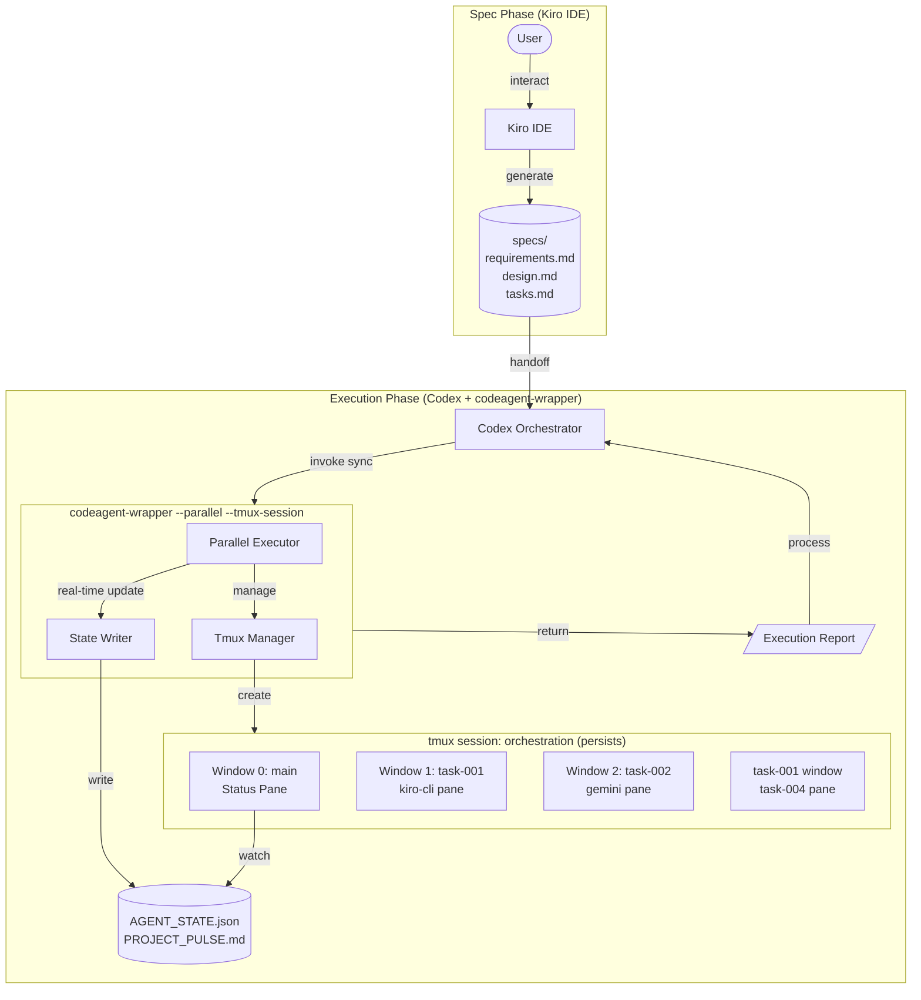
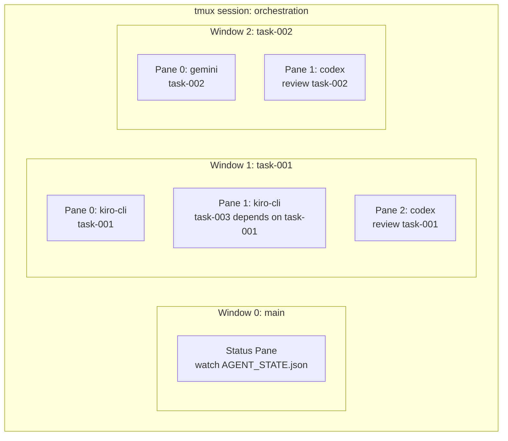
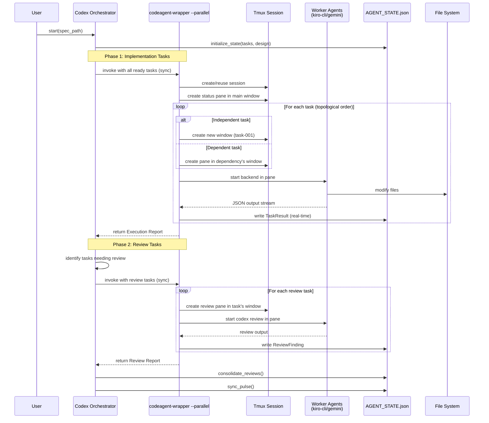
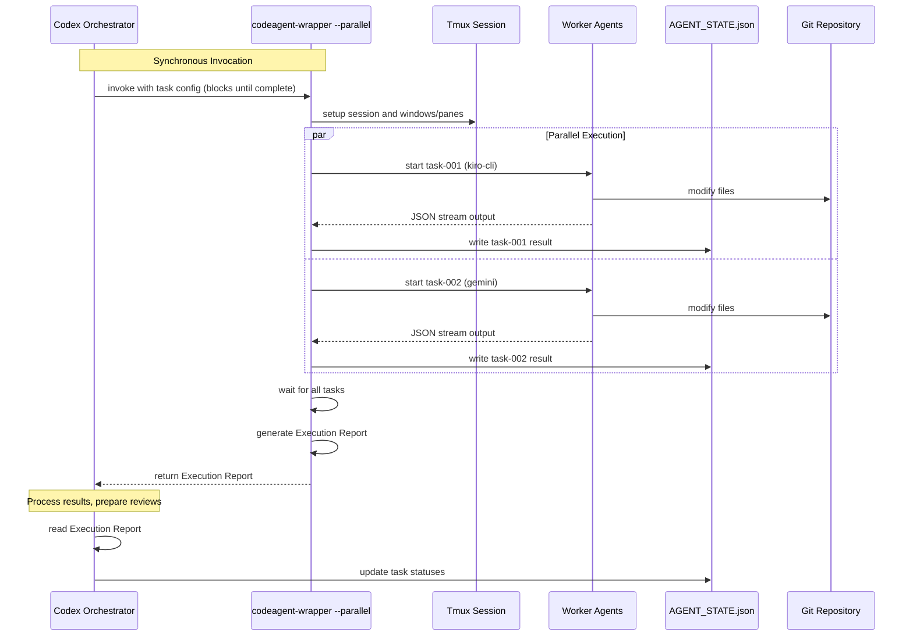
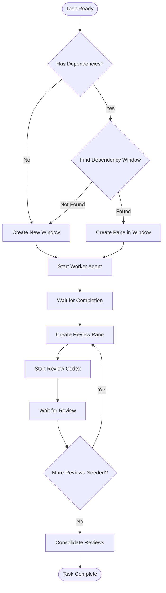

# Design Document

## Overview

This system implements a two-phase multi-agent orchestration architecture:

1. **Spec Phase**: User interacts with Kiro IDE to produce requirements.md, design.md, and tasks.md
2. **Execution Phase**: Codex orchestrates kiro-cli and Gemini workers within a tmux-based environment

The architecture extends the agent-pulse-coordination pattern with:
- Codex as the central Orchestrator (replacing Claude Code)
- Separate Review_Codex instances for code review
- Tmux window/pane management for task isolation and dependency grouping
- Dual-document state management (PROJECT_PULSE.md + AGENT_STATE.json)

## Architecture



## codeagent-wrapper Integration

The system extends the existing `codeagent-wrapper` Go binary with tmux visualization support while maintaining its synchronous execution model:

- **JSON stream parsing** from CLI backends
- **Parallel execution** with topological sort
- **Structured output** (coverage, files changed, test results)
- **Error handling** (timeout, retry, graceful termination)
- **NEW: Tmux visualization** - tasks run in visible tmux panes
- **NEW: Session persistence** - tmux session survives after wrapper exits

### Execution Model

```
Orchestrator (Codex)
    │
    └── codeagent-wrapper --parallel --tmux-session orch --state-file state.json <<'EOF'
            │                                                    (synchronous call)
            ├── 1. Create/reuse tmux session "orch"
            ├── 2. Create status pane in main window
            ├── 3. For each task layer (topological order):
            │       ├── Create window/pane for each task
            │       ├── Execute backend (kiro-cli/gemini/codex) in pane
            │       ├── Parse JSON output stream
            │       └── Write TaskResult to AGENT_STATE.json (real-time)
            ├── 4. Wait for all tasks to complete
            └── 5. Return Execution Report
                    │
                    └── Orchestrator processes results, dispatches reviews
```

### New Backend: kiro-cli

```go
// backend.go - Add KiroCliBackend
type KiroCliBackend struct{}

func (KiroCliBackend) Name() string { return "kiro-cli" }
func (KiroCliBackend) Command() string { return "kiro" }
func (KiroCliBackend) BuildArgs(cfg *Config, targetArg string) []string {
    args := []string{"chat"}
    if cfg.WorkDir != "" && cfg.WorkDir != "." {
        args = append(args, "-C", cfg.WorkDir)
    }
    args = append(args, "--json", targetArg)
    return args
}
```

### New CLI Flags

```bash
# Full invocation example
codeagent-wrapper --parallel \
  --tmux-session orchestration \
  --tmux-attach \
  --state-file /project/AGENT_STATE.json \
  <<'EOF'
---TASK---
id: task-001
backend: kiro-cli
workdir: .
---CONTENT---
Implement user authentication
---TASK---
id: task-002
backend: gemini
workdir: .
---CONTENT---
Create login form UI
---TASK---
id: task-003
backend: kiro-cli
workdir: .
dependencies: task-001
---CONTENT---
Add password validation
EOF
```

| Flag | Description |
|------|-------------|
| `--tmux-session <name>` | Enable tmux mode, create/reuse session with this name |
| `--tmux-attach` | Keep tmux session alive after completion (default: keep) |
| `--state-file <path>` | Path to AGENT_STATE.json for real-time status updates |

### Tmux Window/Pane Creation Logic

```go
// During parallel execution setup
func (tm *TmuxManager) SetupTaskPanes(tasks []TaskSpec) map[string]string {
    // Track which window each task belongs to
    taskToWindow := make(map[string]string)
    
    for _, task := range tasks {
        if len(task.Dependencies) > 0 {
            // Dependent task: create pane in first dependency's window
            depWindow := taskToWindow[task.Dependencies[0]]
            tm.CreatePane(depWindow, task.ID)
            taskToWindow[task.ID] = depWindow
        } else {
            // Independent task: create new window
            tm.CreateWindow(task.ID)
            taskToWindow[task.ID] = task.ID
        }
    }
    return taskToWindow
}
```

### Tmux Session Layout



### codeagent-wrapper Execution Flow

The Orchestrator dispatches tasks in batches using `--parallel` mode. Here's how different task types are handled within a batch:

**Primary Mode: Batch Execution (--parallel)**

```bash
# Orchestrator invokes codeagent-wrapper with all ready tasks
codeagent-wrapper --parallel \
  --tmux-session orchestration \
  --state-file /path/to/AGENT_STATE.json \
  <<'EOF'
---TASK---
id: task-001
backend: kiro-cli
workdir: .
---CONTENT---
Implement user authentication...

---TASK---
id: task-002
backend: gemini
workdir: .
---CONTENT---
Create login form UI...

---TASK---
id: task-003
backend: kiro-cli
workdir: .
dependencies: task-001
---CONTENT---
Add password validation...
EOF
```

codeagent-wrapper internally handles:
1. **Independent tasks (task-001, task-002)**: Creates new tmux windows
2. **Dependent tasks (task-003)**: Creates pane in dependency's window (task-001)
3. **Parallel execution**: Runs independent tasks concurrently, respects dependencies
4. **Real-time state updates**: Writes TaskResult to AGENT_STATE.json as each task completes
5. **Synchronous return**: Returns Execution Report when all tasks complete

**Legacy Mode: Single Task (for debugging)**

Single-task invocation is still supported for debugging purposes:

```bash
# Single task (creates new window)
codeagent-wrapper \
  --tmux-session orchestration \
  --state-file /path/to/AGENT_STATE.json \
  --backend kiro-cli \
  "Task: Implement user authentication..."

# Single task in existing window (for dependent tasks)
codeagent-wrapper \
  --tmux-session orchestration \
  --window-for task-001 \
  --state-file /path/to/AGENT_STATE.json \
  --backend kiro-cli \
  "Task: Add password validation..."
```

## Components and Interfaces

### 1. Spec Parser

Parses tasks.md to extract task definitions. Agent reads requirements.md and design.md directly when executing tasks.

```python
# Pseudocode
class SpecParser:
    def parse_tasks(tasks_md_path: str) -> List[Task]:
        """
        Parse tasks.md and extract task definitions.
        Returns list of Task objects with id, description, dependencies, type.
        """
        
    def validate_spec_directory(spec_path: str) -> ValidationResult:
        """
        Validate that all required spec files exist (tasks.md, requirements.md, design.md).
        """
    
    def extract_dependencies(tasks: List[Task]) -> DependencyGraph:
        """
        Build dependency graph from tasks and detect circular dependencies.
        """
    
    def get_ready_tasks(tasks: List[Task], completed: Set[str]) -> List[Task]:
        """
        Get tasks ready to execute (all dependencies satisfied).
        """
```

**Note**: Agent reads requirements.md and design.md directly during task execution. No parsing needed - just validate files exist.

### 2. Orchestrator (Codex)

Central coordinator that manages task dispatch via codeagent-wrapper in synchronous batch mode.

```python
# Pseudocode
class Orchestrator:
    def initialize(spec_path: str) -> None:
        """
        Initialize orchestration from spec directory.
        - Parse tasks.md
        - Create AGENT_STATE.json
        - Initialize PROJECT_PULSE.md
        - Setup tmux session (main window with status pane)
        """
        
    def run_orchestration(self) -> None:
        """
        Main orchestration loop using synchronous batch dispatch.
        
        Phase 1: Implementation
        - Collect all ready tasks (no unmet dependencies)
        - Dispatch batch via codeagent-wrapper --parallel (blocks until complete)
        - Process Execution Report
        - Repeat until all implementation tasks complete
        
        Phase 2: Review
        - Collect all tasks needing review
        - Dispatch review batch via codeagent-wrapper --parallel (blocks until complete)
        - Process Review Report
        - Consolidate findings into Final Reports
        """
        
    def dispatch_implementation_batch(self, tasks: List[Task]) -> ExecutionReport:
        """
        Dispatch all ready implementation tasks in a single synchronous call.
        
        codeagent-wrapper --parallel --tmux-session <session> --state-file <path> <<EOF
        ---TASK---
        id: task-001
        backend: kiro-cli
        ...
        EOF
        
        Blocks until all tasks complete, returns ExecutionReport.
        """
        
    def dispatch_review_batch(self, task_ids: List[str]) -> ReviewReport:
        """
        Dispatch all review tasks in a single synchronous call.
        
        codeagent-wrapper --parallel --tmux-session <session> --state-file <path> <<EOF
        ---TASK---
        id: review-001
        backend: codex
        dependencies: task-001
        ...
        EOF
        
        Blocks until all reviews complete, returns ReviewReport.
        """
        
    def process_execution_report(self, report: ExecutionReport) -> None:
        """
        Process results after codeagent-wrapper returns.
        - Update internal task tracking
        - Identify tasks needing review
        - Check for newly unblocked dependent tasks
        - Sync to PROJECT_PULSE.md
        """
        
    def consolidate_reviews(task_id: str) -> FinalReport:
        """
        Consolidate review findings into final report.
        """
```

### 3. Tmux Manager (Go - tmux.go)

New Go component in codeagent-wrapper for tmux operations.

```go
// tmux.go - Tmux management for codeagent-wrapper

package main

import (
    "fmt"
    "os/exec"
    "strings"
)

// TmuxConfig holds tmux-related configuration
type TmuxConfig struct {
    SessionName    string // --tmux-session
    MainWindow     string // --tmux-main-window (default: "main")
    WindowFor      string // --window-for (create pane in existing task's window)
    StateFile      string // --state-file
    IsReview       bool   // --review flag
}

// TmuxManager handles tmux session/window/pane operations
type TmuxManager struct {
    config TmuxConfig
}

func NewTmuxManager(cfg TmuxConfig) *TmuxManager {
    if cfg.MainWindow == "" {
        cfg.MainWindow = "main"
    }
    return &TmuxManager{config: cfg}
}

// SessionExists checks if tmux session exists
func (tm *TmuxManager) SessionExists() bool {
    cmd := exec.Command("tmux", "has-session", "-t", tm.config.SessionName)
    return cmd.Run() == nil
}

// CreateWindow creates a new tmux window for a task
func (tm *TmuxManager) CreateWindow(taskID string) error {
    args := []string{
        "new-window",
        "-t", tm.config.SessionName,
        "-n", taskID,
        "-P", "-F", "#{window_id}",
    }
    cmd := exec.Command("tmux", args...)
    output, err := cmd.Output()
    if err != nil {
        return fmt.Errorf("failed to create window %s: %w", taskID, err)
    }
    logInfo(fmt.Sprintf("Created tmux window: %s (id: %s)", taskID, strings.TrimSpace(string(output))))
    return nil
}

// CreatePane creates a new pane in an existing task's window
func (tm *TmuxManager) CreatePane(targetWindow string) (string, error) {
    args := []string{
        "split-window",
        "-t", fmt.Sprintf("%s:%s", tm.config.SessionName, targetWindow),
        "-P", "-F", "#{pane_id}",
    }
    cmd := exec.Command("tmux", args...)
    output, err := cmd.Output()
    if err != nil {
        return "", fmt.Errorf("failed to create pane in window %s: %w", targetWindow, err)
    }
    paneID := strings.TrimSpace(string(output))
    logInfo(fmt.Sprintf("Created tmux pane in window %s: %s", targetWindow, paneID))
    return paneID, nil
}

// SendCommand sends a command to a specific pane
func (tm *TmuxManager) SendCommand(target string, command string) error {
    args := []string{
        "send-keys",
        "-t", target,
        command,
        "Enter",
    }
    cmd := exec.Command("tmux", args...)
    return cmd.Run()
}

// GetWindowForTask finds the window containing a task
func (tm *TmuxManager) GetWindowForTask(taskID string) (string, error) {
    // Window names match task IDs
    args := []string{
        "list-windows",
        "-t", tm.config.SessionName,
        "-F", "#{window_name}",
    }
    cmd := exec.Command("tmux", args...)
    output, err := cmd.Output()
    if err != nil {
        return "", err
    }
    
    windows := strings.Split(strings.TrimSpace(string(output)), "\n")
    for _, w := range windows {
        if w == taskID {
            return taskID, nil
        }
    }
    return "", fmt.Errorf("window for task %s not found", taskID)
}

// RunInTmux executes the backend command in appropriate tmux context
func (tm *TmuxManager) RunInTmux(taskID string, backendCmd string, backendArgs []string) error {
    var target string
    
    if tm.config.WindowFor != "" {
        // Dependent task: create pane in existing window
        paneID, err := tm.CreatePane(tm.config.WindowFor)
        if err != nil {
            return err
        }
        target = paneID
    } else {
        // Independent task: create new window
        if err := tm.CreateWindow(taskID); err != nil {
            return err
        }
        target = fmt.Sprintf("%s:%s", tm.config.SessionName, taskID)
    }
    
    // Build full command string
    fullCmd := fmt.Sprintf("%s %s", backendCmd, strings.Join(backendArgs, " "))
    
    return tm.SendCommand(target, fullCmd)
}
```

### 4. State Manager

Manages dual-document state (AGENT_STATE.json + PROJECT_PULSE.md).

```python
# Pseudocode
class StateManager:
    def initialize_state(tasks: List[Task], design: Design) -> None:
        """
        Initialize AGENT_STATE.json and PROJECT_PULSE.md.
        """
        
    def update_task_status(task_id: str, status: TaskStatus) -> None:
        """
        Update task status in AGENT_STATE.json.
        Validate state transition.
        """
        
    def write_task_result(result: TaskResult) -> None:
        """
        Write task result from codeagent-wrapper.
        Called by codeagent-wrapper after task completion.
        """
        
    def add_review_finding(finding: ReviewFinding) -> None:
        """
        Add review finding to AGENT_STATE.json.
        """
        
    def add_final_report(report: FinalReport) -> None:
        """
        Add final report to AGENT_STATE.json.
        """
        
    def add_blocked_item(item: BlockedItem) -> None:
        """
        Add blocked item to AGENT_STATE.json.
        """
        
    def add_pending_decision(decision: PendingDecision) -> None:
        """
        Add pending decision to AGENT_STATE.json.
        """
        
    def sync_pulse() -> None:
        """
        Synchronize AGENT_STATE.json to PROJECT_PULSE.md.
        - Update Mental Model if architecture changed
        - Update Narrative Delta with recent completions
        - Update Risks & Debt with blocked items and pending decisions
        - Update Semantic Anchors with new code locations
        """
        
    def validate_state() -> ValidationResult:
        """
        Validate AGENT_STATE.json against schema.
        """
```

### 5. State File Writer (Go - state.go)

New Go component in codeagent-wrapper for writing task results to AGENT_STATE.json.

```go
// state.go - State file operations for codeagent-wrapper

package main

import (
    "encoding/json"
    "os"
    "sync"
    "time"
)

// TaskResultState represents a task result in AGENT_STATE.json
type TaskResultState struct {
    TaskID       string    `json:"task_id"`
    Status       string    `json:"status"`
    ExitCode     int       `json:"exit_code"`
    Output       string    `json:"output,omitempty"`
    Error        string    `json:"error,omitempty"`
    FilesChanged []string  `json:"files_changed,omitempty"`
    Coverage     string    `json:"coverage,omitempty"`
    CoverageNum  float64   `json:"coverage_num,omitempty"`
    TestsPassed  int       `json:"tests_passed,omitempty"`
    TestsFailed  int       `json:"tests_failed,omitempty"`
    WindowID     string    `json:"window_id,omitempty"`
    PaneID       string    `json:"pane_id,omitempty"`
    CompletedAt  time.Time `json:"completed_at"`
}

// ReviewFindingState represents a review finding
type ReviewFindingState struct {
    TaskID    string    `json:"task_id"`
    Reviewer  string    `json:"reviewer"`
    Severity  string    `json:"severity"` // critical, major, minor, none
    Summary   string    `json:"summary"`
    Details   string    `json:"details,omitempty"`
    CreatedAt time.Time `json:"created_at"`
}

// FinalReportState represents a consolidated review report
type FinalReportState struct {
    TaskID          string    `json:"task_id"`
    OverallSeverity string    `json:"overall_severity"`
    Summary         string    `json:"summary"`
    FindingCount    int       `json:"finding_count"`
    CreatedAt       time.Time `json:"created_at"`
}

// BlockedItemState represents a blocked task entry
type BlockedItemState struct {
    TaskID             string    `json:"task_id"`
    BlockingReason     string    `json:"blocking_reason"`
    RequiredResolution string    `json:"required_resolution"`
    CreatedAt          time.Time `json:"created_at"`
}

// PendingDecisionState represents a decision awaiting human input
type PendingDecisionState struct {
    ID        string    `json:"id"`
    TaskID    string    `json:"task_id"`
    Context   string    `json:"context"`
    Options   []string  `json:"options"`
    CreatedAt time.Time `json:"created_at"`
}

// DeferredFixState represents a fix deferred for later
type DeferredFixState struct {
    TaskID      string    `json:"task_id"`
    Description string    `json:"description"`
    Severity    string    `json:"severity"`
    CreatedAt   time.Time `json:"created_at"`
}

// AgentState represents the full AGENT_STATE.json structure
// This struct MUST include ALL fields defined in agent-state-schema.json
type AgentState struct {
    SpecPath         string                 `json:"spec_path"`
    SessionName      string                 `json:"session_name"`
    Tasks            []TaskResultState      `json:"tasks"`
    ReviewFindings   []ReviewFindingState   `json:"review_findings"`
    FinalReports     []FinalReportState     `json:"final_reports"`
    BlockedItems     []BlockedItemState     `json:"blocked_items"`
    PendingDecisions []PendingDecisionState `json:"pending_decisions"`
    DeferredFixes    []DeferredFixState     `json:"deferred_fixes"`
    WindowMapping    map[string]string      `json:"window_mapping"`
}

// StateWriter handles atomic writes to AGENT_STATE.json
type StateWriter struct {
    path string
    mu   sync.Mutex
}

func NewStateWriter(path string) *StateWriter {
    return &StateWriter{path: path}
}

// WriteTaskResult atomically updates task result in state file
func (sw *StateWriter) WriteTaskResult(result TaskResultState) error {
    sw.mu.Lock()
    defer sw.mu.Unlock()
    
    state, err := sw.readState()
    if err != nil {
        return err
    }
    
    // Update or append task result
    found := false
    for i, t := range state.Tasks {
        if t.TaskID == result.TaskID {
            state.Tasks[i] = result
            found = true
            break
        }
    }
    if !found {
        state.Tasks = append(state.Tasks, result)
    }
    
    return sw.writeState(state)
}

// WriteReviewFinding atomically adds review finding to state file
func (sw *StateWriter) WriteReviewFinding(finding ReviewFindingState) error {
    sw.mu.Lock()
    defer sw.mu.Unlock()
    
    state, err := sw.readState()
    if err != nil {
        return err
    }
    
    state.ReviewFindings = append(state.ReviewFindings, finding)
    return sw.writeState(state)
}

// WriteFinalReport atomically adds final report to state file
func (sw *StateWriter) WriteFinalReport(report FinalReportState) error {
    sw.mu.Lock()
    defer sw.mu.Unlock()
    
    state, err := sw.readState()
    if err != nil {
        return err
    }
    
    state.FinalReports = append(state.FinalReports, report)
    return sw.writeState(state)
}

// WriteBlockedItem atomically adds blocked item to state file
func (sw *StateWriter) WriteBlockedItem(item BlockedItemState) error {
    sw.mu.Lock()
    defer sw.mu.Unlock()
    
    state, err := sw.readState()
    if err != nil {
        return err
    }
    
    state.BlockedItems = append(state.BlockedItems, item)
    return sw.writeState(state)
}

// WritePendingDecision atomically adds pending decision to state file
func (sw *StateWriter) WritePendingDecision(decision PendingDecisionState) error {
    sw.mu.Lock()
    defer sw.mu.Unlock()
    
    state, err := sw.readState()
    if err != nil {
        return err
    }
    
    state.PendingDecisions = append(state.PendingDecisions, decision)
    return sw.writeState(state)
}

// WriteDeferredFix atomically adds deferred fix to state file
func (sw *StateWriter) WriteDeferredFix(fix DeferredFixState) error {
    sw.mu.Lock()
    defer sw.mu.Unlock()
    
    state, err := sw.readState()
    if err != nil {
        return err
    }
    
    state.DeferredFixes = append(state.DeferredFixes, fix)
    return sw.writeState(state)
}

func (sw *StateWriter) readState() (*AgentState, error) {
    data, err := os.ReadFile(sw.path)
    if err != nil {
        if os.IsNotExist(err) {
            // Return empty state with all slices initialized
            return &AgentState{
                Tasks:            []TaskResultState{},
                ReviewFindings:   []ReviewFindingState{},
                FinalReports:     []FinalReportState{},
                BlockedItems:     []BlockedItemState{},
                PendingDecisions: []PendingDecisionState{},
                DeferredFixes:    []DeferredFixState{},
                WindowMapping:    make(map[string]string),
            }, nil
        }
        return nil, err
    }
    
    var state AgentState
    if err := json.Unmarshal(data, &state); err != nil {
        return nil, err
    }
    return &state, nil
}

func (sw *StateWriter) writeState(state *AgentState) error {
    data, err := json.MarshalIndent(state, "", "  ")
    if err != nil {
        return err
    }
    
    // Atomic write via temp file
    tmpPath := sw.path + ".tmp"
    if err := os.WriteFile(tmpPath, data, 0644); err != nil {
        return err
    }
    return os.Rename(tmpPath, sw.path)
}

var stateWriterMu sync.Mutex
```

### 6. Task Batch Dispatcher (Synchronous Model)

The Orchestrator dispatches tasks in batches via codeagent-wrapper --parallel, waiting synchronously for completion.

```python
# Pseudocode - Orchestrator side (Synchronous Batch Model)
class TaskBatchDispatcher:
    """
    Dispatches task batches by invoking codeagent-wrapper --parallel.
    Uses synchronous subprocess.run() - blocks until all tasks complete.
    """
    
    def dispatch_implementation_batch(self, tasks: List[Task]) -> ExecutionReport:
        """
        Dispatch all ready implementation tasks in a single codeagent-wrapper call.
        Returns ExecutionReport after all tasks complete.
        """
        task_config = self.build_task_config(tasks)
        
        result = subprocess.run(
            ["codeagent-wrapper", "--parallel",
             "--tmux-session", self.session_name,
             "--state-file", self.state_file_path],
            input=task_config,
            capture_output=True,
            text=True
        )
        
        return self.parse_execution_report(result.stdout)
    
    def dispatch_review_batch(self, task_ids: List[str]) -> ReviewReport:
        """
        Dispatch all review tasks in a single codeagent-wrapper call.
        Returns ReviewReport after all reviews complete.
        """
        review_tasks = [self.build_review_task(tid) for tid in task_ids]
        task_config = self.build_task_config(review_tasks)
        
        result = subprocess.run(
            ["codeagent-wrapper", "--parallel",
             "--tmux-session", self.session_name,
             "--state-file", self.state_file_path],
            input=task_config,
            capture_output=True,
            text=True
        )
        
        return self.parse_review_report(result.stdout)
    
    def build_task_config(self, tasks: List[Task]) -> str:
        """
        Build heredoc-style task configuration for codeagent-wrapper.
        """
        lines = []
        for task in tasks:
            lines.append("---TASK---")
            lines.append(f"id: {task.task_id}")
            lines.append(f"backend: {task.backend}")
            lines.append(f"workdir: {task.workdir}")
            if task.dependencies:
                lines.append(f"dependencies: {','.join(task.dependencies)}")
            lines.append("---CONTENT---")
            lines.append(task.prompt)
        return "\n".join(lines)
    
    def build_review_task(self, task_id: str) -> Task:
        """
        Build a review task for a completed implementation task.
        """
        changes = self.get_task_changes(task_id)
        return Task(
            task_id=f"review-{task_id}",
            backend="codex",
            workdir=".",
            dependencies=[task_id],
            prompt=f"Review {task_id}: {changes}"
        )
```

## Data Models

### Task

```json
{
  "task_id": "string",
  "description": "string",
  "type": "code | ui | review",
  "status": "not_started | in_progress | pending_review | under_review | final_review | completed | blocked",
  "owner_agent": "kiro-cli | gemini | codex-review",
  "dependencies": ["task_id"],
  "criticality": "standard | complex | security-sensitive",
  "window_id": "string",
  "pane_id": "string",
  "output": "string",
  "review_phase": "string",
  "created_at": "ISO timestamp",
  "updated_at": "ISO timestamp"
}
```

### AGENT_STATE.json (Extended)

```json
{
  "spec_path": "string",
  "session_name": "string",
  "tasks": [Task],
  "review_findings": [ReviewFinding],
  "final_reports": [FinalReport],
  "blocked_items": [BlockedItem],
  "pending_decisions": [PendingDecision],
  "deferred_fixes": [DeferredFix],
  "window_mapping": {
    "task_id": "window_id"
  }
}
```

### Tmux Layout Model

```json
{
  "session": {
    "name": "orchestration-{feature_name}",
    "windows": [
      {
        "id": "main",
        "name": "orchestrator",
        "panes": [
          {"id": "orchestrator", "type": "codex", "role": "orchestrator"},
          {"id": "status", "type": "status", "role": "display"}
        ]
      },
      {
        "id": "task-001",
        "name": "task-001",
        "primary_task": "task-001",
        "panes": [
          {"id": "worker", "type": "kiro-cli", "task_id": "task-001"},
          {"id": "review", "type": "codex", "task_id": "task-001", "role": "review"}
        ]
      }
    ]
  }
}
```


## Codex Skills Structure

### Orchestrator Skill

Location: `~/.codex/skills/multi-agent-orchestrator/`

```
multi-agent-orchestrator/
├── SKILL.md              # Main skill definition
├── scripts/
│   ├── parse_tasks.py    # Parse tasks.md
│   ├── dispatch.py       # Dispatch task to agent
│   ├── sync_pulse.py     # Sync state to PULSE
│   └── validate_state.py # Validate AGENT_STATE.json
└── references/
    ├── agent-state-schema.json
    └── task-state-machine.md
```

**SKILL.md Content:**

```markdown
---
name: multi-agent-orchestrator
description: |
  Orchestrate multi-agent workflows with kiro-cli and Gemini workers.
  
  **Trigger Conditions:**
  - WHEN starting execution from a Kiro spec directory
  - WHEN dispatching tasks to worker agents
  - WHEN handling task completion and review
  - WHEN synchronizing state to PULSE document
---

# Multi-Agent Orchestrator

## Overview
Coordinates kiro-cli (code) and Gemini (UI) agents within tmux environment.

## Commands
- `$orchestrator start <spec_path>` - Initialize from spec
- `$orchestrator dispatch <task_id>` - Dispatch specific task
- `$orchestrator status` - Show current state
- `$orchestrator review <task_id>` - Spawn review for task
- `$orchestrator sync` - Sync state to PULSE

## Workflow
1. Parse tasks.md from spec directory
2. Initialize AGENT_STATE.json and PROJECT_PULSE.md
3. Create tmux session with main window
4. Dispatch tasks based on dependencies
5. Handle completions and spawn reviews
6. Consolidate reviews and update state
```

### Custom Prompts

Location: `~/.codex/prompts/`

**dispatch-task.md:**
```markdown
---
description: Dispatch a task to the appropriate worker agent
argument-hint: TASK_ID=<task_id> [FORCE=true]
---

Dispatch task $TASK_ID to the appropriate worker agent.
1. Check task dependencies are satisfied
2. Determine agent type (kiro-cli for code, gemini for UI)
3. Find or create appropriate tmux window
4. Start agent with task instructions
5. Update AGENT_STATE.json status to "in_progress"
```

**spawn-review.md:**
```markdown
---
description: Spawn a Review Codex for a completed task
argument-hint: TASK_ID=<task_id>
---

Spawn Review Codex for task $TASK_ID.
1. Verify task status is "pending_review"
2. Create new pane in task's window
3. Start Codex with review instructions
4. Update task status to "under_review"
```

**sync-pulse.md:**
```markdown
---
description: Synchronize AGENT_STATE.json to PROJECT_PULSE.md
argument-hint: [FULL=true]
---

Sync current state to PROJECT_PULSE.md.
1. Read AGENT_STATE.json
2. Update Mental Model if architecture changed
3. Update Narrative Delta with recent completions
4. Update Risks & Debt with blocked items
5. Update Semantic Anchors with new code locations
```

## Task Dispatch Flow



## Agent Communication Flow



## Communication Protocol Details

### 1. Task Dispatch (Orchestrator → codeagent-wrapper)

The Orchestrator dispatches ALL ready tasks in a single synchronous call:

```bash
# Single invocation with all tasks
codeagent-wrapper --parallel \
  --tmux-session orchestration \
  --state-file /project/AGENT_STATE.json \
  <<'EOF'
---TASK---
id: task-001
backend: kiro-cli
workdir: .
---CONTENT---
Implement user authentication with JWT tokens...

---TASK---
id: task-002
backend: gemini
workdir: .
---CONTENT---
Create login form UI...

---TASK---
id: task-003
backend: kiro-cli
workdir: .
dependencies: task-001
---CONTENT---
Add password validation to auth module...
EOF

# codeagent-wrapper:
# 1. Creates tmux session "orchestration" (or reuses existing)
# 2. Creates window "task-001" with kiro-cli pane
# 3. Creates window "task-002" with gemini pane
# 4. Creates pane in "task-001" window for task-003 (has dependency)
# 5. Executes tasks in parallel (respecting dependencies)
# 6. Writes results to AGENT_STATE.json in real-time
# 7. Returns Execution Report when all complete
```

### 2. Review Dispatch (Orchestrator → codeagent-wrapper)

After implementation tasks complete, Orchestrator dispatches review tasks:

```bash
# Review tasks invocation
codeagent-wrapper --parallel \
  --tmux-session orchestration \
  --state-file /project/AGENT_STATE.json \
  <<'EOF'
---TASK---
id: review-001
backend: codex
workdir: .
dependencies: task-001
---CONTENT---
Review task-001: Audit authentication implementation...
Files changed: src/auth.py, tests/test_auth.py
Produce Review_Finding with severity assessment.

---TASK---
id: review-002
backend: codex
workdir: .
dependencies: task-002
---CONTENT---
Review task-002: Audit login form UI...
Files changed: src/components/LoginForm.tsx
Produce Review_Finding with severity assessment.
EOF

# codeagent-wrapper:
# 1. Creates review pane in task-001's window for review-001
# 2. Creates review pane in task-002's window for review-002
# 3. Executes reviews in parallel
# 4. Writes ReviewFindings to AGENT_STATE.json
# 5. Returns Review Report
```
  --review \
  "Review task-001: Verify authentication implementation..."
```

### 2. Completion Notification (codeagent-wrapper → State File)

codeagent-wrapper automatically handles completion by:
1. Parsing the JSON output stream from the backend
2. Extracting structured data (coverage, files changed, test results)
3. Writing TaskResult to AGENT_STATE.json

```go
// In codeagent-wrapper after task completion
result := TaskResultState{
    TaskID:       taskID,
    Status:       "pending_review",
    ExitCode:     exitCode,
    Output:       parsedMessage,
    FilesChanged: extractedFiles,
    Coverage:     extractedCoverage,
    CoverageNum:  coverageNum,
    TestsPassed:  testsPassed,
    TestsFailed:  testsFailed,
    WindowID:     windowID,
    PaneID:       paneID,
    CompletedAt:  time.Now(),
}

stateWriter.WriteTaskResult(result)
```

### 3. Execution Report Processing (Orchestrator processes results)

After codeagent-wrapper returns, Orchestrator processes the Execution Report synchronously:

```python
# Orchestrator processes Execution Report from codeagent-wrapper
class ExecutionReportProcessor:
    def process_report(self, report: ExecutionReport) -> None:
        """
        Process the Execution Report returned by codeagent-wrapper.
        Called synchronously after codeagent-wrapper completes.
        """
        for task_result in report.task_results:
            # Update internal tracking
            self.update_task_tracking(task_result)
            
            # Check if review is needed
            if task_result.status == "pending_review":
                self.pending_reviews.append(task_result.task_id)
            
            # Check for newly unblocked dependent tasks
            if task_result.status in ["pending_review", "completed"]:
                self.check_dependent_tasks(task_result.task_id)
        
        # After processing all results, dispatch reviews if any
        if self.pending_reviews:
            self.dispatch_review_batch(self.pending_reviews)
```

### 4. Output Collection (via AGENT_STATE.json)

All task output is available in AGENT_STATE.json:

```json
{
  "tasks": [
    {
      "task_id": "task-001",
      "status": "pending_review",
      "exit_code": 0,
      "output": "Implemented JWT authentication with refresh tokens",
      "files_changed": ["src/auth/jwt.py", "src/auth/middleware.py", "tests/test_auth.py"],
      "coverage": "92%",
      "coverage_num": 92.0,
      "tests_passed": 15,
      "tests_failed": 0,
      "window_id": "@1",
      "pane_id": "%1",
      "completed_at": "2026-01-05T10:30:00Z"
    }
  ]
}
```

## Tmux Window Management Flow



## State Transition Validation

```python
# Valid state transitions
VALID_TRANSITIONS = {
    "not_started": ["in_progress", "blocked"],
    "in_progress": ["pending_review", "blocked"],
    "blocked": ["in_progress", "not_started"],
    "pending_review": ["under_review"],
    "under_review": ["final_review"],
    "final_review": ["completed", "in_progress"],  # in_progress if fixes needed
    "completed": []  # terminal state
}

def validate_transition(current: str, target: str) -> bool:
    return target in VALID_TRANSITIONS.get(current, [])
```


## Correctness Properties

*A property is a characteristic or behavior that should hold true across all valid executions of a system—essentially, a formal statement about what the system should do. Properties serve as the bridge between human-readable specifications and machine-verifiable correctness guarantees.*

### Property 1: Task Parsing Round-Trip Consistency

*For any* valid tasks.md file, parsing it and creating AGENT_STATE.json entries SHALL produce task entries that preserve all task IDs, descriptions, dependencies, and types from the original file.

**Validates: Requirements 1.2, 10.3, 10.4**

### Property 2: Agent Assignment by Task Type

*For any* task, the assigned owner_agent SHALL be "kiro-cli" if task type is "code", "gemini" if task type is "ui", and "codex-review" if task type is "review".

**Validates: Requirements 1.3, 10.5**

### Property 3: Dependency-Based Blocking

*For any* task with dependencies, if any dependency task has status other than "completed", the task SHALL have status "blocked" or "not_started".

**Validates: Requirements 1.7**

### Property 4: State Transition Validity

*For any* task state transition, the transition SHALL only be valid if it follows the defined state machine:
- not_started → in_progress | blocked
- in_progress → pending_review | blocked
- blocked → in_progress | not_started
- pending_review → under_review
- under_review → final_review
- final_review → completed | in_progress
- completed → (terminal)

**Validates: Requirements 7.2, 7.3, 7.4, 7.5, 7.6**

### Property 5: Invalid Transition Rejection

*For any* attempted state transition that violates the state machine, the system SHALL reject the transition and the task status SHALL remain unchanged.

**Validates: Requirements 7.6**

### Property 6: Window/Pane Placement by Dependency

*For any* task being dispatched:
- If the task has no dependencies, it SHALL be placed in a new tmux window
- If the task has dependencies, it SHALL be placed in a new pane within the window of its first dependency

**Validates: Requirements 5.2, 5.3**

### Property 7: Window Naming Convention

*For any* tmux window created for a task, the window name SHALL match the primary task identifier (the first task placed in that window).

**Validates: Requirements 5.4**

### Property 8: Review Count by Criticality

*For any* task transitioning to "pending_review":
- If criticality is "standard", exactly 1 Review_Codex SHALL be spawned
- If criticality is "complex" or "security-sensitive", at least 2 Review_Codex instances SHALL be spawned

**Validates: Requirements 8.5, 8.6**

### Property 9: Review Pane Placement

*For any* Review_Codex instance, it SHALL be placed in a new pane within the same window as the task being reviewed.

**Validates: Requirements 8.2**

### Property 10: Review Completion Triggers Consolidation

*For any* task where all required Review_Codex instances have completed, the system SHALL produce a FinalReport in AGENT_STATE.json containing consolidated findings.

**Validates: Requirements 8.9**

### Property 11: AGENT_STATE Schema Conformance

*For any* modification to AGENT_STATE.json, the resulting file SHALL conform to the agent-state-schema.json JSON Schema.

**Validates: Requirements 6.5, 9.5**

### Property 12: Dual Document Synchronization

*For any* task state transition, both AGENT_STATE.json and PROJECT_PULSE.md SHALL be updated to reflect the change.

**Validates: Requirements 6.3**

### Property 13: Task Status Enum Validity

*For any* task in AGENT_STATE.json, the status field SHALL be one of: "not_started", "in_progress", "pending_review", "under_review", "final_review", "completed", "blocked".

**Validates: Requirements 7.1**

### Property 14: Criticality Enum Validity

*For any* task in AGENT_STATE.json, the criticality field SHALL be one of: "standard", "complex", "security-sensitive".

**Validates: Requirements 7.7**

### Property 15: Blocked Task Has Blocked Item Entry

*For any* task with status "blocked", there SHALL exist a corresponding entry in blocked_items with matching task reference.

**Validates: Requirements 3.5, 9.2**

### Property 16: codeagent-wrapper State File Update

*For any* task executed via codeagent-wrapper with `--state-file` flag, upon task completion (success or failure), codeagent-wrapper SHALL write a TaskResult entry to the specified AGENT_STATE.json file.

**Validates: Requirements 9.1, 9.3**

### Property 17: Tmux Window Creation for Independent Tasks

*For any* task dispatched via codeagent-wrapper with `--tmux-session` flag and without `--window-for` flag, codeagent-wrapper SHALL create a new tmux window named with the task ID.

**Validates: Requirements 5.2, 5.4**

### Property 18: Tmux Pane Creation for Dependent Tasks

*For any* task dispatched via codeagent-wrapper with both `--tmux-session` and `--window-for` flags, codeagent-wrapper SHALL create a new pane in the window specified by `--window-for`.

**Validates: Requirements 5.3**

## Error Handling

### Spec Parsing Errors

| Error | Handling |
|-------|----------|
| tasks.md not found | Report error, abort initialization |
| Invalid task format | Report specific line, skip task, continue |
| Circular dependency | Report cycle, abort initialization |
| Missing dependency reference | Report missing task ID, mark as blocked |

### State Transition Errors

| Error | Handling |
|-------|----------|
| Invalid transition | Reject, log error, return failure |
| Schema validation failure | Reject change, restore previous state |
| Concurrent modification | Use file locking, retry with backoff |

### Tmux Errors

| Error | Handling |
|-------|----------|
| Session creation failure | Report error, suggest manual creation |
| Window/pane creation failure | Retry once, then report and mark task blocked |
| Agent process died unexpectedly | Detect via hook, mark task blocked, notify orchestrator |

### Agent Communication Errors

| Error | Handling |
|-------|----------|
| Agent timeout | Mark task blocked, add to blocked_items |
| Invalid task update format | Reject update, log error |
| Review finding malformed | Request re-review or mark for manual review |

## codeagent-wrapper Extension Design

### New Files to Add

```
codeagent-wrapper/
├── tmux.go           # Tmux session/window/pane management
├── tmux_test.go      # Tmux unit tests
├── state.go          # AGENT_STATE.json read/write operations
├── state_test.go     # State file unit tests
├── kiro_cli_backend.go   # KiroCliBackend implementation
└── kiro_cli_backend_test.go
```

### Config Extension

```go
// config.go - Add new fields to Config struct
type Config struct {
    // ... existing fields ...
    
    // Tmux integration
    TmuxSession    string // --tmux-session
    TmuxMainWindow string // --tmux-main-window
    WindowFor      string // --window-for (dependent task placement)
    StateFile      string // --state-file
    IsReview       bool   // --review flag
}

// parseArgs extension
func parseArgs() (*Config, error) {
    cfg := &Config{}
    args := os.Args[1:]
    
    for i := 0; i < len(args); i++ {
        switch args[i] {
        case "--tmux-session":
            if i+1 >= len(args) {
                return nil, fmt.Errorf("--tmux-session requires a value")
            }
            cfg.TmuxSession = args[i+1]
            i++
        case "--window-for":
            if i+1 >= len(args) {
                return nil, fmt.Errorf("--window-for requires a value")
            }
            cfg.WindowFor = args[i+1]
            i++
        case "--state-file":
            if i+1 >= len(args) {
                return nil, fmt.Errorf("--state-file requires a value")
            }
            cfg.StateFile = args[i+1]
            i++
        case "--review":
            cfg.IsReview = true
        // ... existing cases ...
        }
    }
    
    return cfg, nil
}
```

### Main Flow Extension

```go
// main.go - Add tmux mode handling
func run() (exitCode int) {
    // ... existing initialization ...
    
    cfg, err := parseArgs()
    if err != nil {
        logError(err.Error())
        return 1
    }
    
    // Check if tmux mode is enabled
    if cfg.TmuxSession != "" {
        return runTmuxMode(cfg)
    }
    
    // ... existing non-tmux flow ...
}

func runTmuxMode(cfg *Config) int {
    tmuxMgr := NewTmuxManager(TmuxConfig{
        SessionName: cfg.TmuxSession,
        MainWindow:  cfg.TmuxMainWindow,
        WindowFor:   cfg.WindowFor,
        StateFile:   cfg.StateFile,
        IsReview:    cfg.IsReview,
    })
    
    // Verify session exists
    if !tmuxMgr.SessionExists() {
        logError(fmt.Sprintf("tmux session %s does not exist", cfg.TmuxSession))
        return 1
    }
    
    // Generate task ID if not provided
    taskID := cfg.TaskID
    if taskID == "" {
        taskID = generateTaskID()
    }
    
    // Select backend
    backend, err := selectBackendFn(cfg.Backend)
    if err != nil {
        logError(err.Error())
        return 1
    }
    
    // Build backend args
    targetArg := cfg.Task
    if cfg.UseStdin {
        targetArg = "-"
    }
    backendArgs := backend.BuildArgs(cfg, targetArg)
    
    // Initialize state writer
    var stateWriter *StateWriter
    if cfg.StateFile != "" {
        stateWriter = NewStateWriter(cfg.StateFile)
        
        // Write initial status
        stateWriter.WriteTaskResult(TaskResultState{
            TaskID:   taskID,
            Status:   "in_progress",
            WindowID: "", // Will be set after window creation
        })
    }
    
    // Run in tmux
    if err := tmuxMgr.RunInTmux(taskID, backend.Command(), backendArgs); err != nil {
        logError(err.Error())
        if stateWriter != nil {
            stateWriter.WriteTaskResult(TaskResultState{
                TaskID:   taskID,
                Status:   "blocked",
                Error:    err.Error(),
                ExitCode: 1,
            })
        }
        return 1
    }
    
    // Wait for backend to complete and capture result
    result := waitForBackendCompletion(tmuxMgr, taskID, cfg.Timeout)
    
    // Write final result to state file
    if stateWriter != nil {
        status := "pending_review"
        if result.ExitCode != 0 {
            status = "blocked"
        }
        if cfg.IsReview {
            status = "review_completed"
        }
        
        stateWriter.WriteTaskResult(TaskResultState{
            TaskID:       taskID,
            Status:       status,
            ExitCode:     result.ExitCode,
            Output:       result.Message,
            Error:        result.Error,
            FilesChanged: result.FilesChanged,
            Coverage:     result.Coverage,
            CoverageNum:  result.CoverageNum,
            TestsPassed:  result.TestsPassed,
            TestsFailed:  result.TestsFailed,
            CompletedAt:  time.Now(),
        })
    }
    
    return result.ExitCode
}
```

### Backend Registration

```go
// backend.go - Add kiro-cli backend to registry
var backends = map[string]Backend{
    "codex":    CodexBackend{},
    "claude":   ClaudeBackend{},
    "gemini":   GeminiBackend{},
    "kiro-cli": KiroCliBackend{},  // New
}

func selectBackend(name string) (Backend, error) {
    if b, ok := backends[name]; ok {
        return b, nil
    }
    return nil, fmt.Errorf("unknown backend: %s", name)
}
```

## Testing Strategy

### Unit Tests

Unit tests verify specific examples and edge cases:

1. **Spec Parser Tests**
   - Parse valid tasks.md with various formats
   - Handle malformed markdown gracefully
   - Detect circular dependencies
   - Extract task metadata correctly

2. **State Manager Tests**
   - Initialize state from parsed tasks
   - Validate state transitions
   - Schema validation
   - Concurrent access handling

3. **Tmux Manager Tests**
   - Session creation
   - Window/pane creation
   - Hook registration
   - Command sending

### Property-Based Tests

Property-based tests verify universal properties across generated inputs.

**Testing Framework**: Python `hypothesis` library

**Configuration**: Minimum 100 iterations per property test

**Test Annotations**: Each test tagged with `Feature: multi-agent-orchestration, Property N: <property_text>`

1. **Task Parsing Properties**
   - Generate random valid tasks.md content
   - Verify round-trip consistency
   - Verify all fields preserved

2. **State Transition Properties**
   - Generate random sequences of state transitions
   - Verify only valid transitions succeed
   - Verify invalid transitions are rejected

3. **Window Placement Properties**
   - Generate random task dependency graphs
   - Verify placement rules are followed
   - Verify window naming convention

4. **Review Count Properties**
   - Generate tasks with various criticality levels
   - Verify correct number of reviews spawned

5. **Schema Conformance Properties**
   - Generate random state modifications
   - Verify schema validation catches all violations

### Integration Tests

1. **End-to-End Workflow**
   - Initialize from sample spec
   - Dispatch tasks
   - Simulate completions
   - Verify final state

2. **Tmux Integration**
   - Verify actual tmux session/window/pane creation
   - Verify hooks fire correctly
   - Verify agent commands received

3. **Multi-Agent Coordination**
   - Simulate multiple agents working concurrently
   - Verify state consistency
   - Verify review workflow
