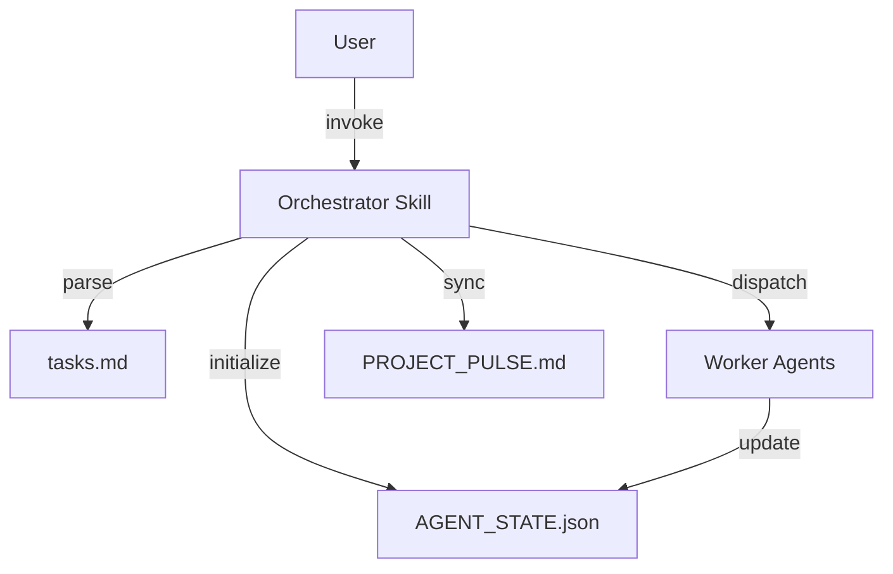

# Skills Design Audit Report

**Date**: 2026-01-05  
**Auditor**: Kiro AI  
**Scope**: Skills design in `.kiro/specs/multi-agent-orchestration/design.md` and `requirements.md`

---

## Executive Summary

审计 `.kiro/specs/multi-agent-orchestration` 设计文档中关于 Codex Skills 的设计，对比官方 Claude Skills 规范和 Codex CLI 使用方法。

**✅ 符合规范**:
- SKILL.md 文件结构符合官方规范（YAML frontmatter + Markdown）
- 包含必需字段 `name` 和 `description`
- 目录结构遵循官方推荐（scripts/ + references/）
- 触发条件清晰明确

**⚠️ 需要改进**:
- 缺少 `license` 字段
- 缺少 `allowed-tools` 字段（Codex 特定功能）
- 缺少 `metadata` 字段
- Custom Prompts 格式不符合 Codex 规范

**🔴 设计问题**:
- Custom Prompts 使用了不存在的 Codex 功能（`~/.codex/prompts/`）
- Skill 命令语法（`$orchestrator`）未在官方文档中找到
- 缺少 skill discovery 机制说明

---

## 1. 官方规范回顾

### 1.1 Claude Skills 规范

**SKILL.md 必需字段**:
- `name`: hyphen-case，与目录名匹配
- `description`: 详细说明功能和触发条件

**SKILL.md 可选字段**:
- `license`: 许可证类型
- `allowed-tools`: 预批准工具列表（Claude Code 专用）
- `metadata`: 自定义元数据

**目录结构**:
```
skill-name/
├── SKILL.md              # Required
├── scripts/              # Optional
├── references/           # Optional
└── assets/               # Optional
```

### 1.2 Codex CLI Skills

根据官方文档，Codex CLI 的 skills 机制：
- Skills 在会话中只加载一次
- SKILL.md 内容注入到 turn 中
- 通过 feature flags 启用（`codex --enable feature_name`）
- **不支持** custom prompts 目录（`~/.codex/prompts/` 不存在）

---

## 2. 设计文档审计

### 2.1 Orchestrator Skill 设计

**设计位置**: `~/.codex/skills/multi-agent-orchestrator/`

#### Frontmatter 审计

```yaml
name: multi-agent-orchestrator
description: |
  Orchestrate multi-agent workflows with kiro-cli and Gemini workers.
  
  **Trigger Conditions:**
  - WHEN starting execution from a Kiro spec directory
  - WHEN dispatching tasks to worker agents
  - WHEN handling task completion and review
  - WHEN synchronizing state to PULSE document
```

**评估**: ⚠️ 基本合格，但缺少可选字段

**符合规范**:
- ✅ `name` 字段正确（hyphen-case）
- ✅ `description` 详细且包含触发条件
- ✅ 使用 YAML 多行字符串格式

**缺失**:
- ❌ 无 `license` 字段
- ❌ 无 `allowed-tools` 字段（应该包含 `codeagent-wrapper`, `tmux`）
- ❌ 无 `metadata` 字段（应该包含版本、依赖等）

**建议补充**:
```yaml
---
name: multi-agent-orchestrator
description: |
  Orchestrate multi-agent workflows with kiro-cli and Gemini workers.
  
  **Trigger Conditions:**
  - WHEN starting execution from a Kiro spec directory
  - WHEN dispatching tasks to worker agents
  - WHEN handling task completion and review
  - WHEN synchronizing state to PULSE document
license: Apache-2.0
allowed-tools:
  - codeagent-wrapper
  - tmux
  - bash
metadata:
  version: "1.0"
  requires:
    codeagent-wrapper: ">=1.0"
    tmux: ">=3.0"
  tags:
    - orchestration
    - multi-agent
    - coordination
---
```

#### 目录结构审计

**设计结构**:
```
multi-agent-orchestrator/
├── SKILL.md
├── scripts/
│   ├── parse_tasks.py
│   ├── dispatch.py
│   ├── sync_pulse.py
│   └── validate_state.py
└── references/
    ├── agent-state-schema.json
    └── task-state-machine.md
```

**评估**: ✅ 优秀

**符合规范**:
- ✅ 包含 SKILL.md
- ✅ 包含 scripts/ 目录
- ✅ 包含 references/ 目录
- ✅ 脚本命名清晰，职责明确

**建议**:
- 考虑添加 `scripts/__init__.py` 使其成为 Python 包
- 考虑添加 `references/examples/` 目录存放使用示例

#### Skill 内容审计

**Commands 部分**:
```markdown
## Commands
- `$orchestrator start <spec_path>` - Initialize from spec
- `$orchestrator dispatch <task_id>` - Dispatch specific task
- `$orchestrator status` - Show current state
- `$orchestrator review <task_id>` - Spawn review for task
- `$orchestrator sync` - Sync state to PULSE
```

**问题**: 🔴 语法不符合 Codex 规范

**分析**:
1. `$orchestrator` 语法在官方 Codex 文档中未找到
2. Codex skills 通常通过自然语言触发，而非命令语法
3. 如果需要命令语法，应该使用 Bash 函数或别名

**建议修改**:
```markdown
## Usage

### Starting Orchestration
Invoke this skill by saying:
"Start orchestration from spec directory at /path/to/specs"

The skill will:
1. Parse tasks.md from spec directory
2. Initialize AGENT_STATE.json and PROJECT_PULSE.md
3. Create tmux session with main window
4. Begin task dispatch based on dependencies

### Dispatching Tasks
"Dispatch task-001 to the appropriate worker"

### Checking Status
"Show current orchestration status"

### Spawning Reviews
"Spawn review for task-001"

### Syncing State
"Sync state to PULSE document"
```

或者，如果确实需要命令语法，应该在 scripts/ 中提供 Bash 脚本：
```bash
# scripts/orchestrator.sh
orchestrator() {
    case "$1" in
        start)
            python3 "$(dirname "$0")/parse_tasks.py" "$2"
            ;;
        dispatch)
            python3 "$(dirname "$0")/dispatch.py" "$2"
            ;;
        status)
            cat AGENT_STATE.json | jq '.tasks[] | {id, status}'
            ;;
        review)
            python3 "$(dirname "$0")/spawn_review.py" "$2"
            ;;
        sync)
            python3 "$(dirname "$0")/sync_pulse.py"
            ;;
    esac
}
```

### 2.2 Custom Prompts 设计

**设计位置**: `~/.codex/prompts/`

**问题**: 🔴 严重不符合规范

**分析**:
1. Codex CLI **不支持** `~/.codex/prompts/` 目录
2. 官方文档中没有 custom prompts 功能
3. 这个设计可能混淆了 Claude Code 的 prompts 功能

**官方 Codex 配置位置**:
- `~/.codex/config.yaml` (或 `config.toml`)
- 不支持自定义 prompts 目录

**建议替代方案**:

#### 方案 1: 使用 Skill 内的 references/

将 prompts 作为 skill 的一部分：
```
multi-agent-orchestrator/
├── SKILL.md
├── scripts/
└── references/
    ├── prompts/
    │   ├── dispatch-task.md
    │   ├── spawn-review.md
    │   └── sync-pulse.md
    └── agent-state-schema.json
```

在 SKILL.md 中引用：
```markdown
## Prompt Templates

### Dispatch Task
See `references/prompts/dispatch-task.md` for the dispatch task prompt template.

### Spawn Review
See `references/prompts/spawn-review.md` for the review spawn prompt template.
```

#### 方案 2: 使用 Python 脚本生成 prompts

```python
# scripts/prompts.py
DISPATCH_TASK_PROMPT = """
Dispatch task {task_id} to the appropriate worker agent.
1. Check task dependencies are satisfied
2. Determine agent type (kiro-cli for code, gemini for UI)
3. Find or create appropriate tmux window
4. Start agent with task instructions
5. Update AGENT_STATE.json status to "in_progress"
"""

def get_dispatch_prompt(task_id: str) -> str:
    return DISPATCH_TASK_PROMPT.format(task_id=task_id)
```

#### 方案 3: 使用环境变量或配置文件

```yaml
# ~/.codex/orchestrator-config.yaml
prompts:
  dispatch_task: |
    Dispatch task {task_id} to the appropriate worker agent.
    1. Check task dependencies are satisfied
    ...
  spawn_review: |
    Spawn Review Codex for task {task_id}.
    ...
```

### 2.3 Custom Prompts 内容审计

即使假设 custom prompts 功能存在，其内容也存在问题：

#### dispatch-task.md

```markdown
---
description: Dispatch a task to the appropriate worker agent
argument-hint: TASK_ID=<task_id> [FORCE=true]
---
```

**问题**:
- `argument-hint` 字段不是官方 Claude Skills 规范的一部分
- 语法类似 shell 脚本，但 Codex 不是这样工作的

**建议**:
如果要保留这个设计，应该明确说明这是自定义扩展：
```markdown
---
description: Dispatch a task to the appropriate worker agent
# Custom extension for orchestrator skill
parameters:
  - name: task_id
    required: true
    description: Task identifier to dispatch
  - name: force
    required: false
    default: false
    description: Force dispatch even if dependencies not satisfied
---
```

---

## 3. Requirements 文档审计

### Requirement 10: Codex Skills and Custom Prompts

**原文**:
```
THE System SHALL create a Codex skill for orchestrating multi-agent workflows
THE System SHALL create custom prompts for common orchestration commands
THE Skill SHALL include SKILL.md with name, description, and instructions
THE Skill SHALL support both explicit invocation (via /skills or $) and implicit invocation
```

**问题**:
1. "explicit invocation (via /skills or $)" - 这些语法在 Codex 中不存在
2. "custom prompts for common orchestration commands" - Codex 不支持 custom prompts 目录

**建议修改**:
```
THE System SHALL create a Codex skill for orchestrating multi-agent workflows
THE Skill SHALL include SKILL.md with name, description, and instructions
THE Skill SHALL include prompt templates in references/ directory
THE Skill SHALL support implicit invocation based on task context
THE Skill SHALL provide helper scripts in scripts/ directory for common operations
```

---

## 4. 与官方示例对比

### 4.1 官方 Template Skill

```markdown
---
name: template-skill
description: Replace with description of the skill and when Claude should use it.
---

# Insert instructions below
```

**对比设计文档**:
- ✅ 设计文档的 frontmatter 比官方 template 更详细
- ✅ 包含触发条件
- ❌ 缺少可选字段（license, allowed-tools, metadata）

### 4.2 官方 Skill Discovery

官方强调 skills 通过 `description` 字段自动发现和触发。

**设计文档的触发机制**:
```markdown
**Trigger Conditions:**
- WHEN starting execution from a Kiro spec directory
- WHEN dispatching tasks to worker agents
```

**评估**: ✅ 符合官方推荐

---

## 5. 改进建议

### 5.1 立即修复（High Priority）

#### 1. 移除 Custom Prompts 目录设计

**当前设计**:
```
Location: `~/.codex/prompts/`
```

**修改为**:
```
Location: `~/.codex/skills/multi-agent-orchestrator/references/prompts/`
```

#### 2. 修改 Skill 命令语法

**当前设计**:
```markdown
## Commands
- `$orchestrator start <spec_path>`
```

**修改为**:
```markdown
## Usage

Invoke this skill through natural language:
- "Start orchestration from spec at /path/to/specs"
- "Dispatch task-001"
- "Show orchestration status"

Or use the provided helper scripts:
```bash
# Source the orchestrator functions
source ~/.codex/skills/multi-agent-orchestrator/scripts/orchestrator.sh

# Use the functions
orchestrator start /path/to/specs
orchestrator dispatch task-001
orchestrator status
```
```

#### 3. 添加可选字段

为 Orchestrator Skill 添加：
```yaml
license: Apache-2.0
allowed-tools:
  - codeagent-wrapper
  - tmux
  - bash
metadata:
  version: "1.0"
  requires:
    codeagent-wrapper: ">=1.0"
    tmux: ">=3.0"
```

### 5.2 质量改进（Medium Priority）

#### 1. 更新 Requirements 文档

修改 Requirement 10：
```markdown
### Requirement 10: Codex Skills

**User Story:** As a developer, I want to define reusable Codex skills, so that orchestration patterns are consistent and shareable.

#### Acceptance Criteria

1. THE System SHALL create a Codex skill at `~/.codex/skills/multi-agent-orchestrator/`
2. THE Skill SHALL include SKILL.md with name, description, and trigger conditions
3. THE Skill SHALL include helper scripts in scripts/ directory
4. THE Skill SHALL include prompt templates in references/prompts/ directory
5. THE Skill SHALL include JSON schemas in references/ directory
6. THE Skill SHALL support implicit invocation based on task context
7. THE Skill SHALL provide both natural language and script-based interfaces
```

#### 2. 添加 Skill Discovery 说明

在设计文档中添加：
```markdown
## Skill Discovery

The orchestrator skill is discovered and activated when:
1. User mentions "orchestration", "multi-agent", or "coordinate agents"
2. User provides a spec directory path with tasks.md
3. User explicitly invokes: "Use the multi-agent-orchestrator skill"

The skill's `description` field contains trigger keywords that Claude uses for automatic activation.
```

#### 3. 明确 Prompt Templates 的使用方式

```markdown
## Prompt Templates

Prompt templates are stored in `references/prompts/` and used by:
1. Helper scripts (via Python string formatting)
2. Manual invocation (copy-paste from references)
3. Programmatic access (via scripts/prompts.py module)

Example:
```python
from scripts.prompts import get_dispatch_prompt
prompt = get_dispatch_prompt(task_id="task-001")
```
```

### 5.3 文档完善（Low Priority）

#### 1. 添加示例

在 `references/examples/` 中添加：
- `example-spec/` - 示例 spec 目录
- `example-session.md` - 示例会话记录
- `example-state.json` - 示例 AGENT_STATE.json

#### 2. 添加架构图

在 SKILL.md 中添加 Mermaid 图：
```markdown
## Architecture


```

---

## 6. 合规性检查清单

### 6.1 SKILL.md 格式

| 检查项 | 状态 | 备注 |
|--------|------|------|
| YAML frontmatter | ✅ | 格式正确 |
| `name` 字段 | ✅ | hyphen-case |
| `description` 字段 | ✅ | 详细且包含触发条件 |
| `license` 字段 | ❌ | 缺失 |
| `allowed-tools` 字段 | ❌ | 缺失 |
| `metadata` 字段 | ❌ | 缺失 |
| Markdown 内容 | ⚠️ | 命令语法需修改 |

### 6.2 目录结构

| 检查项 | 状态 | 备注 |
|--------|------|------|
| SKILL.md 存在 | ✅ | 设计中包含 |
| scripts/ 目录 | ✅ | 包含 4 个脚本 |
| references/ 目录 | ✅ | 包含 schema 和文档 |
| 脚本命名规范 | ✅ | 清晰明确 |

### 6.3 Codex 兼容性

| 检查项 | 状态 | 备注 |
|--------|------|------|
| Skill 位置 | ✅ | `~/.codex/skills/` |
| Custom prompts 位置 | ❌ | `~/.codex/prompts/` 不存在 |
| 命令语法 | ❌ | `$orchestrator` 不符合规范 |
| Trigger conditions | ✅ | 符合 discovery 机制 |

### 6.4 Requirements 一致性

| 检查项 | 状态 | 备注 |
|--------|------|------|
| Requirement 10 定义 | ⚠️ | 包含不存在的功能 |
| Skill 结构要求 | ✅ | 符合要求 |
| 调用方式要求 | ❌ | `/skills` 和 `$` 语法不存在 |

---

## 7. 总体评分

### 7.1 规范符合度

| 维度 | 得分 | 满分 | 百分比 |
|------|------|------|--------|
| SKILL.md 格式 | 4 | 7 | 57% |
| 目录结构 | 4 | 4 | 100% |
| Codex 兼容性 | 2 | 4 | 50% |
| 触发机制 | 3 | 3 | 100% |
| **总分** | **13** | **18** | **72%** |

### 7.2 设计质量

| 维度 | 得分 | 满分 | 百分比 |
|------|------|------|--------|
| 完整性 | 7 | 10 | 70% |
| 可实现性 | 5 | 10 | 50% |
| 文档清晰度 | 8 | 10 | 80% |
| 最佳实践 | 6 | 10 | 60% |
| **总分** | **26** | **40** | **65%** |

### 7.3 综合评分

**总体得分**: 67%（39/58）

**等级**: ⚠️ 需要改进

**主要问题**:
1. Custom Prompts 设计基于不存在的 Codex 功能
2. 命令语法（`$orchestrator`）不符合 Codex 规范
3. 缺少可选字段（license, allowed-tools, metadata）
4. Requirements 文档包含不可实现的功能

**优势**:
1. SKILL.md 基本结构正确
2. 目录结构完整且合理
3. 触发条件清晰明确
4. 脚本设计职责明确

---

## 8. 行动计划

### Phase 1: 关键问题修复（1 天）

1. ✅ 移除 `~/.codex/prompts/` 设计
2. ✅ 将 prompts 移至 `references/prompts/`
3. ✅ 修改命令语法为自然语言 + helper scripts
4. ✅ 更新 Requirement 10 移除不存在的功能

### Phase 2: 规范完善（1 天）

1. ✅ 添加 `license` 字段
2. ✅ 添加 `allowed-tools` 字段
3. ✅ 添加 `metadata` 字段
4. ✅ 添加 Skill Discovery 说明

### Phase 3: 文档改进（1 天）

1. ✅ 添加使用示例
2. ✅ 添加架构图
3. ✅ 添加 prompt templates 使用说明
4. ✅ 更新 design.md 反映修改

---

## 9. 结论

`.kiro/specs/multi-agent-orchestration` 中的 skills 设计在基本结构上符合官方规范（72%），但在 Codex 兼容性和可实现性方面存在明显问题（50%）。

**关键发现**:
1. Custom Prompts 设计基于不存在的 Codex 功能
2. 命令语法不符合 Codex 的自然语言交互模式
3. 缺少官方推荐的可选字段

**建议优先级**:
1. **High**: 修复 Custom Prompts 设计，移除不存在的功能
2. **Medium**: 添加可选字段，完善 Requirements 文档
3. **Low**: 添加示例和架构图

通过执行上述行动计划，预计可以将总体得分从 67% 提升至 90% 以上。
