# Design Document

## Overview

This design addresses three critical issues in the multi-agent orchestration system:

1. **Parent-Subtask Execution Model** - Correcting the task dispatch logic to treat parent tasks as containers
2. **File Conflict Detection** - Adding file manifest support and conflict detection for parallel safety
3. **Fix Loop Workflow** - Implementing retry logic with escalation for failed reviews

The implementation extends the existing `spec_parser.py`, `dispatch_batch.py`, and related orchestration scripts.

## Architecture

```mermaid
flowchart TB
    subgraph TaskDispatch["Task Dispatch Flow"]
        Tasks[(tasks.md)]
        Parser[Spec Parser]
        Filter[Leaf Task Filter]
        Conflict[Conflict Detector]
        Batch[Batch Builder]
        Wrapper[codeagent-wrapper]
        
        Tasks --> Parser
        Parser --> Filter
        Filter -->|"leaf tasks only"| Conflict
        Conflict -->|"conflict-free batches"| Batch
        Batch --> Wrapper
    end
    
    subgraph FixLoop["Fix Loop Flow"]
        Review[Review Result]
        Severity{Severity?}
        Block[Block Dependents]
        Inject[Inject Feedback]
        Retry[Re-dispatch]
        Escalate[Escalate Agent]
        Human[Human Fallback]
        
        Review --> Severity
        Severity -->|"none/minor"| Complete[Complete]
        Severity -->|"critical/major"| Block
        Block --> Inject
        Inject --> Retry
        Retry -->|"pass"| Complete
        Retry -->|"fail < 3"| Inject
        Retry -->|"fail = 2"| Escalate
        Escalate --> Inject
        Retry -->|"fail = 3"| Human
    end
    
    subgraph ParentStatus["Parent Status Aggregation"]
        Subtasks[Subtask Statuses]
        Aggregate[Aggregate Logic]
        Parent[Parent Status]
        
        Subtasks --> Aggregate
        Aggregate --> Parent
    end
```



## Components and Interfaces

### 1. Leaf Task Filter

Filters out parent tasks from the ready task list, ensuring only leaf tasks are dispatched.

```python
def is_leaf_task(task: Task) -> bool:
    """Check if task is a leaf task (has no subtasks)."""
    return len(task.subtasks) == 0

def get_ready_leaf_tasks(tasks: List[Task], completed_ids: Set[str]) -> List[Task]:
    """
    Get leaf tasks ready to execute (all dependencies satisfied).
    
    Rules:
    1. Task must be a leaf task (no subtasks)
    2. Task must not be completed
    3. All dependencies must be satisfied (including expanded parent deps)
    """
    ready = []
    task_map = {t.task_id: t for t in tasks}
    
    for task in tasks:
        # Skip parent tasks (they have subtasks)
        if task.subtasks:
            continue
        
        # Skip completed tasks
        if task.task_id in completed_ids or task.status == TaskStatus.COMPLETED:
            continue
        
        # Expand and check dependencies
        expanded_deps = expand_dependencies(task.dependencies, task_map)
        if all(dep in completed_ids for dep in expanded_deps):
            ready.append(task)
    
    return ready
```

### 2. Dependency Expander

Expands parent task dependencies to their subtasks.

```python
def expand_dependencies(dependencies: List[str], task_map: Dict[str, Task]) -> List[str]:
    """
    Expand parent task dependencies to their subtasks.
    
    If a dependency is a parent task, replace it with all its subtasks.
    This ensures dependent tasks wait for ALL subtasks to complete.
    """
    expanded = []
    
    for dep_id in dependencies:
        dep_task = task_map.get(dep_id)
        
        if dep_task and dep_task.subtasks:
            # Parent task: expand to all subtasks (recursively)
            for subtask_id in dep_task.subtasks:
                expanded.extend(expand_dependencies([subtask_id], task_map))
        else:
            # Leaf task or unknown: keep as-is
            expanded.append(dep_id)
    
    return list(dict.fromkeys(expanded))  # Remove duplicates, preserve order

def build_dependency_graph_with_implicit_edges(tasks: List[Task]) -> DependencyGraph:
    """
    Build dependency graph including implicit parent-subtask relationships (Req 5.5).
    
    Implicit edges:
    - Parent task implicitly depends on all its subtasks (for status aggregation)
    - These are not execution dependencies but status dependencies
    """
    graph = DependencyGraph()
    task_map = {t.task_id: t for t in tasks}
    
    for task in tasks:
        # Add explicit dependencies (expanded)
        expanded_deps = expand_dependencies(task.dependencies, task_map)
        graph.add_task(task.task_id, expanded_deps)
        
        # Add implicit parent -> subtask edges (for status tracking)
        # Note: These don't affect execution order, only status aggregation
        if task.subtasks:
            for subtask_id in task.subtasks:
                graph.add_implicit_edge(task.task_id, subtask_id, "parent-subtask")
    
    return graph
```

### 3. Parent Status Aggregator

Updates parent task status based on subtask completion.

```python
def update_parent_statuses(state: Dict[str, Any]) -> None:
    """
    Update parent task statuses based on subtask completion.
    
    Rules:
    - All subtasks completed → parent completed
    - Any subtask in_progress → parent in_progress
    - Any subtask blocked → parent blocked
    - Any subtask fix_required → parent fix_required
    - Otherwise → parent not_started
    """
    task_map = {t["task_id"]: t for t in state["tasks"]}
    
    for task in state["tasks"]:
        subtask_ids = task.get("subtasks", [])
        if not subtask_ids:
            continue  # Leaf task, skip
        
        subtask_statuses = [task_map[sid]["status"] for sid in subtask_ids if sid in task_map]
        
        if not subtask_statuses:
            continue
        
        # Determine parent status from subtask statuses
        if all(s == "completed" for s in subtask_statuses):
            task["status"] = "completed"
        elif any(s == "blocked" for s in subtask_statuses):
            task["status"] = "blocked"
        elif any(s == "fix_required" for s in subtask_statuses):
            task["status"] = "fix_required"
        elif any(s in ["in_progress", "pending_review", "under_review", "final_review"] for s in subtask_statuses):
            task["status"] = "in_progress"
        else:
            task["status"] = "not_started"
```

### 4. File Conflict Detector

Detects file write conflicts between parallel tasks.

```python
@dataclass
class FileConflict:
    """Represents a file conflict between two tasks."""
    task_a: str
    task_b: str
    files: List[str]
    conflict_type: str  # "write-write" or "read-write"

def has_file_manifest(task: Task) -> bool:
    """Check if task has a file manifest (writes or reads declared)."""
    return bool(task.writes) or bool(task.reads)

def detect_file_conflicts(tasks: List[Task]) -> List[FileConflict]:
    """
    Detect file write conflicts between tasks.
    
    Returns list of conflicts that would occur if tasks run in parallel.
    """
    conflicts = []
    
    for i, task_a in enumerate(tasks):
        writes_a = set(task_a.writes or [])
        
        for task_b in tasks[i+1:]:
            writes_b = set(task_b.writes or [])
            
            # Check write-write conflicts
            shared_writes = writes_a & writes_b
            if shared_writes:
                conflicts.append(FileConflict(
                    task_a=task_a.task_id,
                    task_b=task_b.task_id,
                    files=list(shared_writes),
                    conflict_type="write-write"
                ))
    
    return conflicts

def partition_by_conflicts(tasks: List[Task], logger=None) -> List[List[Task]]:
    """
    Partition tasks into conflict-free batches.
    
    Rules:
    - Tasks with write-write conflicts are placed in separate batches
    - Tasks without ANY file manifest (no writes AND no reads) are executed serially
    - Tasks with only reads (no writes) can be batched with non-conflicting write tasks
    - Tasks with non-conflicting writes can be batched together
    
    Batches are guaranteed to run sequentially (batch N completes before batch N+1 starts).
    """
    # Categorize tasks
    no_manifest_tasks = []      # No writes AND no reads - serial for safety
    safe_tasks = []             # Has reads only OR has writes - can check conflicts
    
    for task in tasks:
        if not task.writes and not task.reads:
            no_manifest_tasks.append(task)
        else:
            safe_tasks.append(task)
    
    batches = []
    
    # Safe tasks (with manifest): partition by write conflicts
    if safe_tasks:
        # Only tasks with writes can have conflicts
        write_tasks = [t for t in safe_tasks if t.writes]
        read_only_tasks = [t for t in safe_tasks if not t.writes]
        
        conflicts = detect_file_conflicts(write_tasks)
        conflict_pairs = {(c.task_a, c.task_b) for c in conflicts}
        conflict_pairs.update({(c.task_b, c.task_a) for c in conflicts})
        
        # Log warnings for conflicts (Req 2.7)
        if conflicts and logger:
            for conflict in conflicts:
                logger.warning(
                    f"File conflict detected between {conflict.task_a} and {conflict.task_b}: "
                    f"{', '.join(conflict.files)}. Tasks will be serialized."
                )
        
        # Greedy coloring to partition write tasks into non-conflicting batches
        assigned = set()
        
        for task in write_tasks:
            if task.task_id in assigned:
                continue
            
            # Find a batch where this task has no conflicts
            placed = False
            for batch in batches:
                batch_ids = {t.task_id for t in batch}
                if not any((task.task_id, bid) in conflict_pairs for bid in batch_ids):
                    batch.append(task)
                    assigned.add(task.task_id)
                    placed = True
                    break
            
            if not placed:
                batches.append([task])
                assigned.add(task.task_id)
        
        # Read-only tasks can be added to any batch (no write conflicts)
        # Add them to the first batch for maximum parallelism (Req 2.6)
        if read_only_tasks:
            if batches:
                batches[0].extend(read_only_tasks)
            else:
                batches.append(read_only_tasks)
    
    # No-manifest tasks run serially (each in own batch) - conservative default
    for task in no_manifest_tasks:
        if logger:
            logger.info(f"Task {task.task_id} has no file manifest, executing serially for safety.")
        batches.append([task])
    
    return batches
```

### 5. Fix Loop Manager

Manages the fix loop workflow for failed reviews.

**Key Definitions:**
- `fix_attempts` counts the number of **completed fix attempts** (0 = no fix completed yet)
- Initial review failure triggers fix loop entry, fix_attempts = 0
- fix_attempts is incremented AFTER a fix attempt completes (regardless of success/failure)
- Escalation happens when fix_attempts >= 2 (after 2 fix attempts completed and failed)
- Human fallback happens when fix_attempts >= 3 (after 3 fix attempts completed and failed)

**Timeline Example:**
```
Initial review fails     → fix_attempts = 0, enter fix loop
1st fix dispatched       → fix_attempts = 0 (display: "Attempt 1/3")
1st fix completes        → fix_attempts = 1
1st fix review fails     → fix_attempts = 1, continue fix loop
2nd fix dispatched       → fix_attempts = 1 (display: "Attempt 2/3")
2nd fix completes        → fix_attempts = 2
2nd fix review fails     → fix_attempts = 2, continue fix loop, ESCALATE
3rd fix dispatched       → fix_attempts = 2 (display: "Attempt 3/3", using Codex)
3rd fix completes        → fix_attempts = 3
3rd fix review fails     → fix_attempts = 3, HUMAN FALLBACK
```

```python
MAX_FIX_ATTEMPTS = 3
ESCALATION_THRESHOLD = 2  # Escalate after 2 failed attempts

class FixLoopAction(Enum):
    """Actions from fix loop evaluation."""
    PASS = "pass"              # Review passed, continue
    RETRY = "retry"            # Retry with same agent
    ESCALATE = "escalate"      # Switch to Codex and retry
    HUMAN_FALLBACK = "human"   # Max retries, need human

@dataclass
class FixRequest:
    """Request to fix a task based on review findings."""
    task_id: str
    attempt_number: int          # Current attempt (1-indexed for display): completed + 1
    completed_attempts: int      # Number of completed fix attempts before this one
    review_findings: List[Dict]
    original_output: str
    fix_instructions: str
    review_history: List[Dict]   # Full history for escalation
    use_escalation_agent: bool = False

def should_enter_fix_loop(severity: str) -> bool:
    """Determine if review severity requires fix loop."""
    return severity in ["critical", "major"]

def evaluate_fix_loop_action(task: Dict, severity: str) -> FixLoopAction:
    """
    Determine next action based on review result and completed attempt count.
    
    fix_attempts = number of COMPLETED fix attempts:
    - 0 completed: RETRY with original agent (this will be attempt 1)
    - 1 completed: RETRY with original agent (this will be attempt 2)
    - 2 completed: ESCALATE to Codex (this will be attempt 3)
    - 3 completed: HUMAN_FALLBACK (no more attempts)
    """
    if not should_enter_fix_loop(severity):
        return FixLoopAction.PASS
    
    # fix_attempts = number of completed fix attempts
    completed_attempts = task.get("fix_attempts", 0)
    
    if completed_attempts >= MAX_FIX_ATTEMPTS:
        return FixLoopAction.HUMAN_FALLBACK
    
    if completed_attempts >= ESCALATION_THRESHOLD:
        return FixLoopAction.ESCALATE
    
    return FixLoopAction.RETRY

def create_fix_request(
    state: Dict,
    task_id: str,
    findings: List[Dict]
) -> FixRequest:
    """Create fix request with review feedback."""
    task = next(t for t in state["tasks"] if t["task_id"] == task_id)
    completed_attempts = task.get("fix_attempts", 0)
    review_history = task.get("review_history", [])
    
    # Build fix instructions from findings
    instructions = []
    for finding in findings:
        if finding["severity"] in ["critical", "major"]:
            instructions.append(f"- [{finding['severity'].upper()}] {finding['summary']}")
            if finding.get("details"):
                instructions.append(f"  Details: {finding['details']}")
    
    # Determine if escalation is needed (after 2 completed attempts)
    use_escalation = completed_attempts >= ESCALATION_THRESHOLD
    
    return FixRequest(
        task_id=task_id,
        attempt_number=completed_attempts + 1,  # Display: 1, 2, or 3
        completed_attempts=completed_attempts,
        review_findings=findings,
        original_output=task.get("output", ""),
        fix_instructions="\n".join(instructions),
        review_history=review_history,
        use_escalation_agent=use_escalation
    )

def format_review_history(history: List[Dict]) -> str:
    """Format review history for inclusion in escalation prompt."""
    if not history:
        return "No previous attempts."
    
    lines = []
    for entry in history:
        attempt = entry.get("attempt", 0)
        if attempt == 0:
            lines.append("### Initial Implementation Review")
        else:
            lines.append(f"### Fix Attempt {attempt} Review")
        
        lines.append(f"Severity: {entry['severity']}")
        
        # Format findings (list of {severity, summary, details} objects)
        findings = entry.get("findings", [])
        if findings:
            lines.append("Findings:")
            for finding in findings:
                if isinstance(finding, dict):
                    sev = finding.get("severity", "unknown")
                    summary = finding.get("summary", "No summary")
                    lines.append(f"  - [{sev.upper()}] {summary}")
                    if finding.get("details"):
                        lines.append(f"    Details: {finding['details']}")
                else:
                    # Fallback for string findings (legacy format)
                    lines.append(f"  - {finding}")
        
        lines.append("")
    return "\n".join(lines)

def build_fix_prompt(fix_request: FixRequest, task: Dict) -> str:
    """Build prompt for fix attempt."""
    base_prompt = f"""## FIX REQUEST - Attempt {fix_request.attempt_number}/{MAX_FIX_ATTEMPTS}

### Original Task
{task['description']}

### Review Findings (MUST FIX)
{fix_request.fix_instructions}

### Previous Output
{fix_request.original_output[:2000]}...

### Instructions
1. Review the findings above carefully
2. Fix ALL critical and major issues
3. Ensure the fix doesn't break existing functionality
4. Run tests to verify the fix
"""
    
    # Include full history for escalation (Req 6.5)
    if fix_request.use_escalation_agent and fix_request.review_history:
        history_section = f"""
### Previous Fix Attempts History
{format_review_history(fix_request.review_history)}
"""
        base_prompt += history_section
    
    return base_prompt

def get_all_dependent_task_ids(state: Dict, task_id: str) -> Set[str]:
    """
    Get all tasks that depend on the given task (transitive closure).
    
    Includes:
    - Direct dependents (tasks with task_id in their dependencies)
    - Transitive dependents (tasks depending on direct dependents)
    - Tasks depending on parent if task_id is a subtask
    
    Uses BFS to find transitive closure of dependents.
    """
    task_map = {t["task_id"]: t for t in state["tasks"]}
    
    # Build reverse dependency map (task -> tasks that depend on it)
    reverse_deps = {}
    for t in state["tasks"]:
        deps = t.get("dependencies", [])
        expanded_deps = expand_dependencies(deps, task_map)
        for dep in expanded_deps:
            reverse_deps.setdefault(dep, set()).add(t["task_id"])
    
    # Find the parent if this is a subtask
    task = task_map.get(task_id)
    parent_id = task.get("parent_id") if task else None
    
    # BFS to find transitive closure
    visited = set()
    queue = [task_id]
    
    # Also start from parent if this is a subtask
    if parent_id:
        queue.append(parent_id)
    
    while queue:
        current = queue.pop(0)
        if current in visited:
            continue
        visited.add(current)
        
        # Add all tasks that depend on current
        for dependent in reverse_deps.get(current, []):
            if dependent not in visited:
                queue.append(dependent)
    
    # Remove the original task from results
    visited.discard(task_id)
    if parent_id:
        visited.discard(parent_id)
    
    return visited

def block_dependent_tasks(state: Dict, task_id: str, reason: str) -> None:
    """
    Block all tasks that depend on the failed task.
    
    Uses expanded dependencies to handle parent-subtask relationships (Req 3.2 + Req 5).
    """
    task_map = {t["task_id"]: t for t in state["tasks"]}
    dependent_ids = get_all_dependent_task_ids(state, task_id)
    
    for dep_id in dependent_ids:
        dep_task = task_map.get(dep_id)
        if dep_task and dep_task["status"] not in ["completed", "blocked"]:
            dep_task["status"] = "blocked"
            dep_task["blocked_reason"] = reason
            dep_task["blocked_by"] = task_id
    
    # Add to blocked_items
    state.setdefault("blocked_items", []).append({
        "task_id": task_id,
        "blocking_reason": reason,
        "dependent_tasks": list(dependent_ids),
        "created_at": datetime.utcnow().isoformat() + "Z"
    })

def unblock_dependent_tasks(state: Dict, task_id: str) -> None:
    """
    Unblock tasks that were blocked by the given task (Req 3.9).
    
    Called when a fix loop succeeds.
    """
    for task in state["tasks"]:
        if task.get("blocked_by") == task_id:
            task["status"] = "not_started"
            task["blocked_reason"] = None
            task["blocked_by"] = None
    
    # Remove from blocked_items
    state["blocked_items"] = [
        item for item in state.get("blocked_items", [])
        if item["task_id"] != task_id
    ]

def handle_fix_loop_success(state: Dict, task_id: str) -> None:
    """
    Handle successful fix loop completion.
    
    - Transition task to final_review/completed
    - Unblock dependent tasks
    """
    task = next(t for t in state["tasks"] if t["task_id"] == task_id)
    task["status"] = "final_review"
    
    # Unblock dependents
    unblock_dependent_tasks(state, task_id)

def trigger_human_fallback(state: Dict, task_id: str) -> None:
    """Suspend task and request human intervention."""
    task = next(t for t in state["tasks"] if t["task_id"] == task_id)
    
    task["status"] = "blocked"
    task["blocked_reason"] = "human_intervention_required"
    
    # Include review history in context
    history_text = format_review_history(task.get("review_history", []))
    
    state.setdefault("pending_decisions", []).append({
        "id": f"human-fallback-{task_id}",
        "task_id": task_id,
        "priority": "critical",
        "context": f"""HUMAN INTERVENTION REQUIRED

Task: {task_id} - {task['description']}
Fix Attempts: {task.get('fix_attempts', 0)}/{MAX_FIX_ATTEMPTS}

Review History:
{history_text}

Action Required:
1. Review the code and findings manually
2. Either fix the issue or adjust requirements
3. Resume orchestration when ready
""",
        "options": [
            "I've fixed it manually - resume",
            "Skip this task - continue without it",
            "Abort orchestration"
        ],
        "created_at": datetime.utcnow().isoformat() + "Z"
    })
    
    # Block dependent tasks
    block_dependent_tasks(state, task_id, "Upstream task requires human intervention")
```

### 6. Task Data Model Extension

Extended task fields for fix loop support.

```python
@dataclass
class Task:
    """Extended task with fix loop fields."""
    task_id: str
    description: str
    task_type: TaskType = TaskType.CODE
    status: TaskStatus = TaskStatus.NOT_STARTED
    dependencies: List[str] = field(default_factory=list)
    is_optional: bool = False
    parent_id: Optional[str] = None
    subtasks: List[str] = field(default_factory=list)
    details: List[str] = field(default_factory=list)
    
    # File manifest (NEW)
    writes: List[str] = field(default_factory=list)
    reads: List[str] = field(default_factory=list)
    
    # Fix loop fields (NEW)
    fix_attempts: int = 0
    max_fix_attempts: int = 3
    escalated: bool = False
    escalated_at: Optional[str] = None
    original_agent: Optional[str] = None
    last_review_severity: Optional[str] = None
    review_history: List[Dict] = field(default_factory=list)
    blocked_reason: Optional[str] = None
    blocked_by: Optional[str] = None
```

### 7. State Machine Extension

Extended state machine with fix_required status.

```python
class TaskStatus(Enum):
    """Extended task status enumeration."""
    NOT_STARTED = "not_started"
    IN_PROGRESS = "in_progress"
    PENDING_REVIEW = "pending_review"
    UNDER_REVIEW = "under_review"
    FIX_REQUIRED = "fix_required"  # NEW
    FINAL_REVIEW = "final_review"
    COMPLETED = "completed"
    BLOCKED = "blocked"

# Valid state transitions
VALID_TRANSITIONS = {
    "not_started": ["in_progress", "blocked"],
    "in_progress": ["pending_review", "blocked"],
    "pending_review": ["under_review", "blocked"],
    "under_review": ["final_review", "fix_required", "blocked"],  # NEW: fix_required
    "fix_required": ["in_progress", "blocked"],  # NEW
    "final_review": ["completed", "blocked"],
    "completed": [],
    "blocked": ["not_started", "in_progress", "fix_required"],  # NEW: can go to fix_required
}

def validate_transition(from_status: str, to_status: str) -> bool:
    """Validate state transition."""
    valid_targets = VALID_TRANSITIONS.get(from_status, [])
    return to_status in valid_targets
```

## Batch Execution Model

Batches returned by `partition_by_conflicts()` are executed **sequentially**:
- Batch N must complete entirely before Batch N+1 starts
- Within a batch, tasks may run in parallel (via codeagent-wrapper --parallel)
- This ensures file conflict safety between batches

```python
def dispatch_batches_sequentially(batches: List[List[Task]], state: Dict) -> None:
    """
    Dispatch batches sequentially, waiting for each to complete.
    
    This ensures:
    1. No file conflicts between batches
    2. Serial execution for no-manifest tasks
    3. Parallel execution within conflict-free batches
    """
    for i, batch in enumerate(batches):
        logger.info(f"Dispatching batch {i+1}/{len(batches)} with {len(batch)} tasks")
        
        # Dispatch batch via codeagent-wrapper --parallel
        # This call blocks until all tasks in batch complete
        report = invoke_codeagent_wrapper(batch, state)
        
        # Process results before next batch
        process_execution_report(state, report)
        
        # Update parent statuses after each batch
        update_parent_statuses(state)
```

## Fix Loop Scheduling (Req 4.6)

Tasks in `fix_required` status are processed by the fix loop scheduler:

```python
def get_fix_required_tasks(state: Dict) -> List[Dict]:
    """Get tasks that need fix loop processing."""
    return [t for t in state["tasks"] if t.get("status") == "fix_required"]

def enter_fix_loop(state: Dict, task_id: str, review_findings: List[Dict]) -> None:
    """
    Enter fix loop for a task after review finds critical/major issues (Req 3.1, 3.2).
    
    This function is called when review completes with critical/major severity.
    
    Steps:
    1. Update task status to fix_required
    2. Store review findings in review_history
    3. Block all dependent tasks
    """
    task = next(t for t in state["tasks"] if t["task_id"] == task_id)
    
    # Determine overall severity from findings
    severities = [f.get("severity", "minor") for f in review_findings]
    if "critical" in severities:
        overall_severity = "critical"
    elif "major" in severities:
        overall_severity = "major"
    else:
        overall_severity = "minor"
    
    # Update task state
    task["status"] = "fix_required"
    task["last_review_severity"] = overall_severity
    
    # Calculate the attempt number for this review
    # fix_attempts = completed fix attempts, so:
    # - Initial review failure: fix_attempts = 0, this is review of initial impl (attempt 0)
    # - After 1st fix completes: fix_attempts = 1, this is review of fix attempt 1
    # - After 2nd fix completes: fix_attempts = 2, this is review of fix attempt 2
    # - After 3rd fix completes: fix_attempts = 3, this is review of fix attempt 3
    completed_attempts = task.get("fix_attempts", 0)
    
    # Add to review history (structured format for prompt injection)
    # attempt = 0 means initial implementation review
    # attempt = N means review of fix attempt N
    task.setdefault("review_history", []).append({
        "attempt": completed_attempts,  # 0 for initial, 1/2/3 for fix attempts
        "severity": overall_severity,
        "findings": review_findings,  # List of {severity, summary, details}
        "reviewed_at": datetime.utcnow().isoformat() + "Z"
    })
    
    # Block dependent tasks (Req 3.2)
    block_dependent_tasks(state, task_id, f"Upstream task {task_id} requires fixes ({overall_severity})")

def process_fix_loop(state: Dict) -> None:
    """
    Process all tasks in fix_required status (Req 4.6).
    
    For each fix_required task:
    1. Evaluate action based on COMPLETED attempts (retry, escalate, human_fallback)
    2. Create fix request with feedback
    3. Dispatch fix task
    4. After fix completes, increment fix_attempts in on_fix_task_complete
    5. After review, re-evaluate in on_review_complete
    
    fix_attempts timeline (fix_attempts = COMPLETED attempts):
    - Initial review fails: fix_attempts = 0, status = fix_required
    - 1st fix dispatched: fix_attempts = 0 (display "Attempt 1/3")
    - 1st fix completes: fix_attempts = 1
    - 1st fix review fails: fix_attempts = 1, status = fix_required
    - 2nd fix dispatched: fix_attempts = 1 (display "Attempt 2/3")
    - 2nd fix completes: fix_attempts = 2
    - 2nd fix review fails: fix_attempts = 2, status = fix_required, ESCALATE
    - 3rd fix dispatched: fix_attempts = 2 (display "Attempt 3/3", using Codex)
    - 3rd fix completes: fix_attempts = 3
    - 3rd fix review fails: fix_attempts = 3, HUMAN FALLBACK
    """
    fix_tasks = get_fix_required_tasks(state)
    
    for task in fix_tasks:
        task_id = task["task_id"]
        severity = task.get("last_review_severity", "major")
        
        # Evaluate action based on COMPLETED attempts (before this dispatch)
        completed_attempts = task.get("fix_attempts", 0)
        
        if completed_attempts >= MAX_FIX_ATTEMPTS:
            trigger_human_fallback(state, task_id)
            continue
        
        # Determine if escalation is needed (after 2 completed attempts)
        use_escalation = completed_attempts >= ESCALATION_THRESHOLD
        
        # Get findings from latest review history entry
        review_history = task.get("review_history", [])
        latest_findings = review_history[-1].get("findings", []) if review_history else []
        
        fix_request = create_fix_request(state, task_id, latest_findings)
        
        # Build fix prompt
        prompt = build_fix_prompt(fix_request, task)
        
        # Determine backend (escalate to codex if needed)
        backend = "codex" if use_escalation else task.get("owner_agent", "kiro-cli")
        
        if use_escalation and not task.get("escalated"):
            task["escalated"] = True
            task["escalated_at"] = datetime.utcnow().isoformat() + "Z"
            task["original_agent"] = task.get("owner_agent")
        
        # Transition to in_progress and dispatch
        # NOTE: fix_attempts is NOT incremented here - only after fix completes
        task["status"] = "in_progress"
        
        # Dispatch fix task (single task, not batch)
        dispatch_single_task(state, task_id, backend, prompt)

def on_fix_task_complete(state: Dict, task_id: str) -> None:
    """
    Called when a fix task completes (Req 3.5).
    
    1. Increment fix_attempts (fix attempt completed)
    2. Transition to pending_review
    3. Re-dispatch review
    """
    task = next(t for t in state["tasks"] if t["task_id"] == task_id)
    
    # Increment fix_attempts (fix attempt completed)
    task["fix_attempts"] = task.get("fix_attempts", 0) + 1
    
    # Transition to pending_review
    task["status"] = "pending_review"
    
    # Dispatch review (will be picked up by review dispatch logic)
    # The review result will determine if we stay in fix loop or exit

def on_review_complete(state: Dict, task_id: str, review_findings: List[Dict]) -> None:
    """
    Called when a review completes.
    
    Determines whether to:
    - Exit fix loop (review passed)
    - Continue fix loop (review failed)
    
    Note: fix_attempts is incremented in on_fix_task_complete (when fix completes),
    NOT here. This function only evaluates the review result and decides next action.
    """
    task = next(t for t in state["tasks"] if t["task_id"] == task_id)
    
    # Determine severity
    severities = [f.get("severity", "none") for f in review_findings]
    if "critical" in severities:
        overall_severity = "critical"
    elif "major" in severities:
        overall_severity = "major"
    else:
        overall_severity = "none" if not severities else "minor"
    
    if should_enter_fix_loop(overall_severity):
        # Review failed - enter/continue fix loop
        enter_fix_loop(state, task_id, review_findings)
    else:
        # Review passed - exit fix loop
        handle_fix_loop_success(state, task_id)
```

## Spec Parser File Manifest Extraction (Req 2.2)

The spec parser extracts `_writes:` and `_reads:` markers from task details:

```python
def _extract_file_manifest(details: List[str]) -> Tuple[List[str], List[str]]:
    """
    Extract file manifest from task details.
    
    Parses:
    - _writes: file1.ts, file2.ts
    - _reads: config.ts
    
    Returns (writes, reads) tuple.
    """
    writes = []
    reads = []
    
    for detail in details:
        detail_stripped = detail.strip()
        
        # Parse _writes: marker
        if detail_stripped.startswith("_writes:"):
            files = detail_stripped[8:].strip()
            writes.extend([f.strip() for f in files.split(",") if f.strip()])
        
        # Parse _reads: marker
        elif detail_stripped.startswith("_reads:"):
            files = detail_stripped[7:].strip()
            reads.extend([f.strip() for f in files.split(",") if f.strip()])
    
    return writes, reads

# In parse_tasks(), after parsing task details:
def parse_tasks(content: str) -> TasksParseResult:
    # ... existing parsing logic ...
    
    # After collecting details for a task:
    if current_task:
        current_task.details = current_details
        
        # Extract file manifest (NEW)
        writes, reads = _extract_file_manifest(current_details)
        current_task.writes = writes
        current_task.reads = reads
        
        current_task.task_type = _detect_task_type(current_task.description, current_details)
        tasks.append(current_task)
```

## Data Models

### Extended Task Schema

```json
{
  "task_id": "string",
  "description": "string",
  "type": "code | ui | review",
  "status": "not_started | in_progress | pending_review | under_review | fix_required | final_review | completed | blocked",
  "owner_agent": "kiro-cli | gemini | codex",
  "dependencies": ["task_id"],
  "subtasks": ["task_id"],
  "parent_id": "string | null",
  
  "writes": ["file_path"],
  "reads": ["file_path"],
  
  "fix_attempts": 0,
  "max_fix_attempts": 3,
  "escalated": false,
  "escalated_at": "ISO timestamp | null",
  "original_agent": "string | null",
  "last_review_severity": "critical | major | minor | none | null",
  "review_history": [
    {
      "attempt": 1,
      "severity": "critical",
      "findings": [
        {
          "severity": "critical",
          "summary": "Missing type safety in auth module",
          "details": "The JWT token validation lacks proper type checking..."
        },
        {
          "severity": "major",
          "summary": "Error handling incomplete",
          "details": "Network errors are not properly caught..."
        }
      ],
      "reviewed_at": "ISO timestamp"
    }
  ],
  "blocked_reason": "string | null",
  "blocked_by": "task_id | null"
}
```

### Review Finding Structure

Each finding in `review_history.findings` is a structured object:

```json
{
  "severity": "critical | major | minor | none",
  "summary": "Brief description of the issue",
  "details": "Detailed explanation and suggested fix (optional)"
}
```

This structure enables:
- Filtering by severity for fix prompt injection (Req 3.4, 6.1)
- Displaying severity labels in prompts
- Including detailed context for complex issues

### File Manifest in tasks.md

```markdown
- [ ] 2. Implement JWT authentication
  - Implement token generation and validation
  - _Requirements: 2.1, 2.2_
  - _writes: src/auth/jwt.ts, src/auth/index.ts_
  - _reads: src/config/auth.ts_
```

## Fix Loop State Machine

```
                                    ┌──────────────────┐
                                    │   not_started    │
                                    └────────┬─────────┘
                                             │
                                             ▼
                                    ┌──────────────────┐
                              ┌────►│   in_progress    │◄────┐
                              │     └────────┬─────────┘     │
                              │              │               │
                              │              ▼               │
                              │     ┌──────────────────┐     │
                              │     │  pending_review  │     │
                              │     └────────┬─────────┘     │
                              │              │               │
                              │              ▼               │
                              │     ┌──────────────────┐     │
                              │     │   under_review   │     │
                              │     └────────┬─────────┘     │
                              │              │               │
                              │    ┌─────────┴─────────┐     │
                              │    ▼                   ▼     │
                              │ [none/minor]    [major/critical]
                              │    │                   │     │
                              │    ▼                   ▼     │
                              │ ┌────────┐    ┌─────────────┐│
                              │ │ final  │    │ fix_required││
                              │ │ review │    └──────┬──────┘│
                              │ └───┬────┘           │       │
                              │     │          ┌─────┴─────┐ │
                              │     │          ▼           ▼ │
                              │     │    [attempts<3] [attempts≥3]
                              │     │          │           │
                              │     │          │           ▼
                              │     │          │    ┌─────────────┐
                              │     │          │    │   blocked   │
                              │     │          │    │  (human)    │
                              │     │          │    └─────────────┘
                              │     │          │
                              │     │          └───────────────┘
                              │     │                 (retry)
                              │     ▼
                              │ ┌──────────────────┐
                              │ │    completed     │
                              │ └──────────────────┘
                              │
                              └─── (retry dispatch)
```


## Correctness Properties

*A property is a characteristic or behavior that should hold true across all valid executions of a system-essentially, a formal statement about what the system should do. Properties serve as the bridge between human-readable specifications and machine-verifiable correctness guarantees.*

### Property 1: Leaf Task Filtering

*For any* task list containing parent tasks (tasks with subtasks), when get_ready_tasks() is called, the returned list shall contain only leaf tasks (tasks with no subtasks), regardless of dependency satisfaction.

**Validates: Requirements 1.1, 1.2**

### Property 2: Parent Status Aggregation

*For any* parent task with subtasks, the parent's status shall be derived from its subtasks' statuses according to these rules:
- If all subtasks are completed → parent is completed
- If any subtask is blocked → parent is blocked
- If any subtask is fix_required → parent is fix_required
- If any subtask is in_progress/pending_review/under_review/final_review → parent is in_progress
- Otherwise → parent is not_started

**Validates: Requirements 1.3, 1.4, 1.5**

### Property 3: Dependency Expansion

*For any* task that depends on a parent task, the dependency shall be expanded to include all leaf subtasks of that parent. The dependent task shall only become ready when ALL expanded dependencies are completed.

**Validates: Requirements 1.6, 1.7, 5.1, 5.2, 5.4, 5.5**

### Property 4: File Manifest Parsing

*For any* tasks.md content containing `_writes:` and `_reads:` markers, parsing shall extract these file paths into the task's writes and reads fields respectively.

**Validates: Requirements 2.2**

### Property 5: Conflict-Aware Batching

*For any* set of ready tasks:
- Tasks with write-write conflicts shall be placed in separate batches
- Tasks without file manifests shall each be in their own batch (serial execution)
- Tasks with non-conflicting file manifests may be batched together

**Validates: Requirements 2.3, 2.4, 2.5, 2.6**

### Property 6: Fix Loop Entry

*For any* review result with severity "critical" or "major", the system shall:
1. Enter the fix loop for that task
2. Block all tasks that depend on the failed task

**Validates: Requirements 3.1, 3.2**

### Property 7: Fix Loop Retry Budget

*For any* task in the fix loop:
- After 2 failed attempts, the system shall escalate to Codex
- After 3 failed attempts, the system shall trigger human fallback
- Human fallback shall create a pending_decision entry
- When fix succeeds, dependent tasks shall be unblocked

**Validates: Requirements 3.3, 3.6, 3.7, 3.8, 3.9**

### Property 8: Fix Loop State Transitions

*For any* task, the following state transitions shall be valid:
- under_review → fix_required (when review finds critical/major)
- fix_required → in_progress (when fix is dispatched)
- fix_required → blocked (when max retries exceeded)
- blocked → fix_required (when blocker resolved and fix needed)

All other transitions involving fix_required shall be rejected.

**Validates: Requirements 4.2, 4.3, 4.4, 4.5, 4.6**

### Property 9: Fix Prompt Content

*For any* fix prompt generated for a task:
- The prompt shall include all critical and major findings from the review
- The prompt shall include the original task output
- The prompt shall clearly indicate the attempt number (e.g., "Attempt 2/3")
- When escalating, the prompt shall include the full fix history

**Validates: Requirements 6.1, 6.2, 6.3, 6.4, 6.5**

### Property 10: Review Findings Injection

*For any* fix request, the fix_instructions field shall contain formatted entries for each critical and major finding from the review, with severity labels and summaries.

**Validates: Requirements 3.4**

## Error Handling

### Parent Task Dispatch Attempt

If the system attempts to dispatch a parent task (task with subtasks), it shall:
1. Log an error indicating the invalid dispatch attempt
2. Skip the parent task
3. Continue processing other tasks

### File Conflict Detection Failure

If file conflict detection fails (e.g., malformed file paths), the system shall:
1. Log a warning
2. Default to serial execution for affected tasks
3. Continue with safe execution

### Fix Loop Timeout

If a fix attempt exceeds the timeout:
1. Count it as a failed attempt
2. Proceed to next action (retry, escalate, or human fallback)

### Human Fallback Acknowledgment

When human fallback is triggered:
1. Orchestration for the affected branch shall pause
2. Other independent branches may continue
3. Resume requires explicit human action via pending_decision

## Testing Strategy

### Unit Tests

Unit tests shall cover:
- Leaf task identification edge cases
- Parent status aggregation with various subtask combinations
- Dependency expansion with nested structures
- File manifest parsing with various formats
- Conflict detection with overlapping and non-overlapping files
- Fix loop action evaluation at each threshold
- State transition validation for all valid and invalid transitions
- Fix prompt generation with various finding combinations

### Property-Based Tests

Property-based tests shall use the `hypothesis` library with minimum 100 iterations per property.

Each property test shall be tagged with:
- **Feature: orchestration-fixes, Property {number}: {property_text}**

Test generators shall produce:
- Random task hierarchies with varying depths
- Random file manifests with controlled overlap
- Random review findings with various severities
- Random fix attempt counts

### Integration Tests

Integration tests shall verify:
- End-to-end fix loop workflow
- Batch dispatch with conflict detection
- Parent status updates during orchestration
- Human fallback workflow

## Fix Loop Completion Handling (Req 7)

The fix loop has a critical gap: `on_fix_task_complete()` must be called after fix task execution to increment `fix_attempts`. Without this, escalation and human fallback thresholds are never reached.

### Fix Task Dispatch Flow

```python
def dispatch_fix_task(state: Dict, task: Dict, backend: str, prompt: str) -> bool:
    """
    Dispatch a fix task and handle completion/failure.
    
    Returns True if dispatch succeeded, False if failed.
    """
    task_id = task["task_id"]
    
    try:
        # Transition to in_progress (already done in process_fix_loop)
        # Dispatch the fix task
        result = invoke_codeagent_wrapper_single(task_id, backend, prompt)
        
        if result.success:
            # Fix task completed - increment fix_attempts and transition to pending_review
            on_fix_task_complete(state, task_id)
            return True
        else:
            # Fix task failed - rollback status
            rollback_fix_dispatch(state, task_id)
            return False
            
    except Exception as e:
        # Dispatch failed - rollback status
        logger.error(f"Fix task dispatch failed for {task_id}: {e}")
        rollback_fix_dispatch(state, task_id)
        return False

def rollback_fix_dispatch(state: Dict, task_id: str) -> None:
    """
    Rollback task status after fix dispatch failure (Req 7.4, 7.5).
    
    - Transition from in_progress back to fix_required
    - Do NOT increment fix_attempts
    """
    task = next(t for t in state["tasks"] if t["task_id"] == task_id)
    task["status"] = "fix_required"
    logger.warning(f"Rolled back fix dispatch for {task_id}, status restored to fix_required")
```

### Updated process_fix_loop

```python
def process_fix_loop(state: Dict) -> List[str]:
    """
    Process all tasks in fix_required status.
    
    Returns list of task_ids that were dispatched for fixing.
    """
    fix_tasks = get_fix_required_tasks(state)
    dispatched_ids = []
    
    for task in fix_tasks:
        task_id = task["task_id"]
        completed_attempts = task.get("fix_attempts", 0)
        
        # Check if max attempts reached
        if completed_attempts >= MAX_FIX_ATTEMPTS:
            trigger_human_fallback(state, task_id)
            continue
        
        # Determine if escalation is needed
        use_escalation = completed_attempts >= ESCALATION_THRESHOLD
        
        # Get findings and create fix request
        review_history = task.get("review_history", [])
        latest_findings = review_history[-1].get("findings", []) if review_history else []
        fix_request = create_fix_request(state, task_id, latest_findings)
        
        # Build prompt and determine backend
        prompt = build_fix_prompt(fix_request, task)
        backend = "codex" if use_escalation else task.get("owner_agent", "kiro-cli")
        
        # Handle escalation tracking
        if use_escalation and not task.get("escalated"):
            task["escalated"] = True
            task["escalated_at"] = datetime.utcnow().isoformat() + "Z"
            task["original_agent"] = task.get("owner_agent")
        
        # Transition to in_progress BEFORE dispatch
        task["status"] = "in_progress"
        
        # Dispatch fix task with completion/failure handling
        success = dispatch_fix_task(state, task, backend, prompt)
        
        if success:
            dispatched_ids.append(task_id)
    
    return dispatched_ids
```

## Parent Status Update Consistency (Req 8)

The `update_parent_statuses()` function must run at the end of every dispatch cycle, regardless of what was dispatched.

```python
def dispatch_batch(state: Dict, max_parallel: int = 4) -> Dict:
    """
    Main dispatch function with guaranteed parent status update.
    """
    try:
        # Process fix loop first
        fix_dispatched = process_fix_loop(state)
        
        # Get ready tasks (leaf tasks only)
        ready_tasks = get_ready_leaf_tasks(state)
        
        if not ready_tasks and not fix_dispatched:
            # No tasks to dispatch, but still update parent statuses
            # This handles the case where subtasks completed externally
            pass
        
        # ... rest of dispatch logic ...
        
    finally:
        # ALWAYS update parent statuses at the end (Req 8.1, 8.2, 8.3)
        update_parent_statuses(state)
        
        # Persist state (Req 8.4)
        save_agent_state(state)
    
    return report
```

## Property 11: Fix Attempts Increment

*For any* fix task that completes successfully, the system shall increment `fix_attempts` by exactly 1. *For any* fix task dispatch that fails, the system shall NOT increment `fix_attempts` and shall rollback the task status to `fix_required`.

**Validates: Requirements 7.1, 7.4, 7.5, 7.6**

## Property 12: Parent Status Update Guarantee

*For any* dispatch cycle (including fix-only dispatches and early returns), the system shall call `update_parent_statuses()` exactly once at the end of the cycle.

**Validates: Requirements 8.1, 8.2, 8.3**

