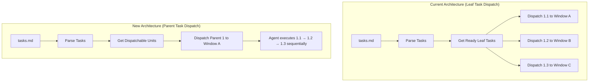
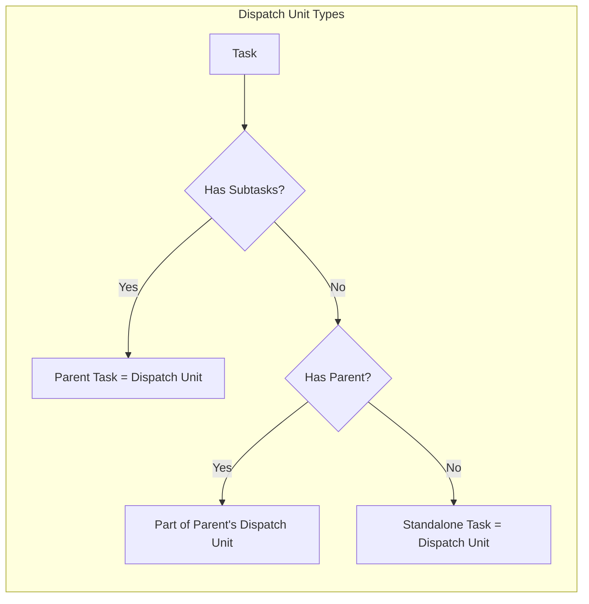
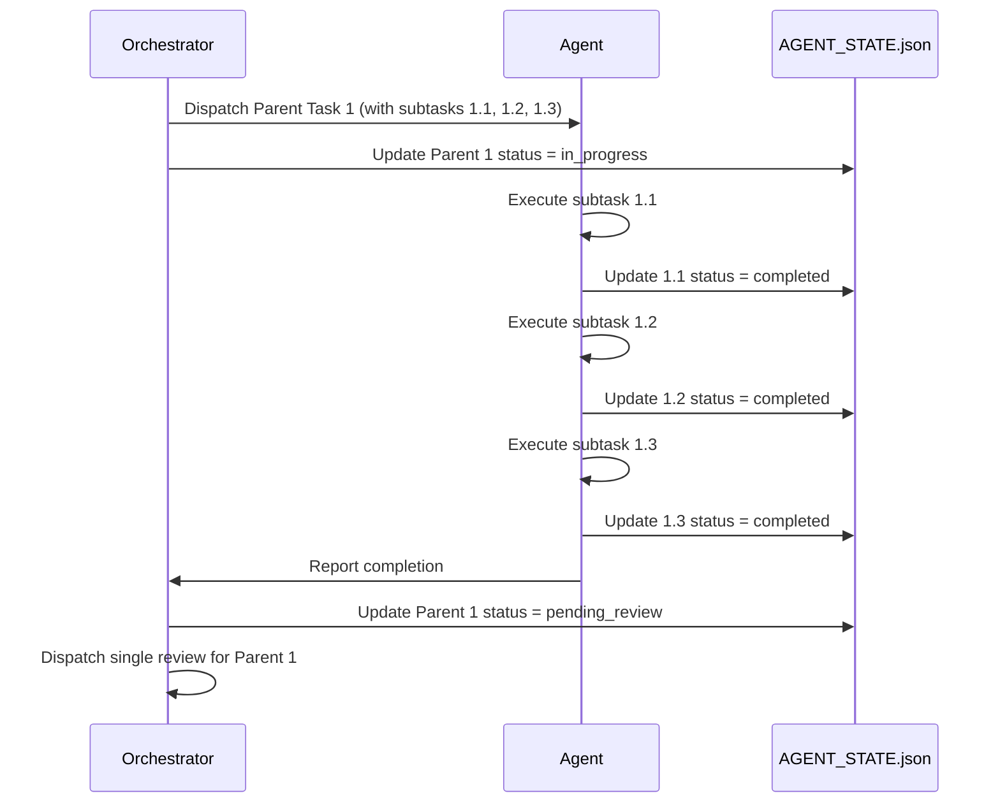

# Design Document: Task Dispatch Granularity Optimization

## Overview

This design document describes the changes needed to optimize task dispatch granularity in the multi-agent orchestration system. The core change is shifting the dispatch unit from individual leaf tasks to parent tasks (task groups), ensuring that all subtasks of a parent task are executed by the same agent in the same tmux window, preserving context continuity.

The current system dispatches each leaf task independently, which breaks context when subtasks are logically related (e.g., "1.1 Create data model", "1.2 Implement API", "1.3 Write tests" are all part of "1. Implement user authentication"). This design introduces the concept of a "Dispatch Unit" that groups related subtasks together.

## Architecture



### Dispatch Unit Definition

A **Dispatch Unit** is the atomic unit of work assigned to a single agent window:



## Components and Interfaces

### 1. Dispatch Unit Identifier (`spec_parser.py`)

New functions to identify dispatch units:

```python
def is_dispatch_unit(task: Task) -> bool:
    """
    Check if task is a dispatch unit (can be dispatched independently).
    
    A task is a dispatch unit if:
    - It has subtasks (parent task), OR
    - It has no subtasks AND no parent (standalone task)
    
    Leaf tasks with parents are NOT dispatch units.
    """
    if task.subtasks:  # Parent task
        return True
    if task.parent_id is None:  # Standalone task (no parent, no subtasks)
        return True
    return False  # Leaf task with parent - not a dispatch unit


def get_dispatchable_units(tasks: List[Task], completed_ids: Set[str]) -> List[Task]:
    """
    Get dispatch units ready for execution.
    
    Returns parent tasks and standalone tasks whose dependencies are satisfied.
    Does NOT return leaf tasks that belong to a parent.
    """
    ready = []
    task_map = {t.task_id: t for t in tasks}
    
    for task in tasks:
        # Only consider dispatch units
        if not is_dispatch_unit(task):
            continue
        
        # Skip completed or in-progress
        if task.task_id in completed_ids or task.status != TaskStatus.NOT_STARTED:
            continue
        
        # Check dependencies (expand parent deps to subtasks)
        expanded_deps = expand_dependencies(task.dependencies, task_map)
        if all(dep in completed_ids for dep in expanded_deps):
            ready.append(task)
    
    return ready
```

### 2. Dispatch Payload Builder (`dispatch_batch.py`)

Modified payload structure to include subtasks:

```python
@dataclass
class DispatchPayload:
    """Payload for dispatching a task group to an agent."""
    dispatch_unit_id: str           # Parent task ID or standalone task ID
    description: str                # Parent/standalone task description
    subtasks: List[SubtaskInfo]     # Ordered list of subtasks (empty for standalone)
    spec_path: str                  # Path to spec directory
    metadata: Dict[str, Any]        # Criticality, file manifests, etc.


@dataclass
class SubtaskInfo:
    """Information about a subtask within a dispatch unit."""
    task_id: str
    description: str
    details: List[str]
    is_optional: bool


def build_dispatch_payload(
    dispatch_unit: Dict[str, Any],
    all_tasks: List[Dict[str, Any]],
    spec_path: str
) -> DispatchPayload:
    """
    Build dispatch payload for a dispatch unit.
    
    For parent tasks: includes all subtasks in order.
    For standalone tasks: includes the task as a single-item list.
    """
    task_id = dispatch_unit["task_id"]
    subtask_ids = dispatch_unit.get("subtasks", [])
    
    # Build subtask info list
    subtasks = []
    if subtask_ids:
        # Parent task: collect all subtasks in order
        task_map = {t["task_id"]: t for t in all_tasks}
        for sid in sorted(subtask_ids):  # Sort to ensure order (1.1, 1.2, 1.3)
            if sid in task_map:
                st = task_map[sid]
                subtasks.append(SubtaskInfo(
                    task_id=st["task_id"],
                    description=st["description"],
                    details=st.get("details", []),
                    is_optional=st.get("is_optional", False)
                ))
    else:
        # Standalone task: include itself as the only "subtask"
        subtasks.append(SubtaskInfo(
            task_id=task_id,
            description=dispatch_unit["description"],
            details=dispatch_unit.get("details", []),
            is_optional=dispatch_unit.get("is_optional", False)
        ))
    
    return DispatchPayload(
        dispatch_unit_id=task_id,
        description=dispatch_unit["description"],
        subtasks=subtasks,
        spec_path=spec_path,
        metadata={
            "criticality": dispatch_unit.get("criticality"),
            "writes": dispatch_unit.get("writes", []),
            "reads": dispatch_unit.get("reads", []),
        }
    )
```

### 3. Agent Prompt Format

The prompt sent to agents will be restructured:

```markdown
# Task Group: {dispatch_unit_id}

## Overview
{parent_description}

## Subtasks (Execute in Order)

### Step 1: {subtask_1.task_id} - {subtask_1.description}
{subtask_1.details}

### Step 2: {subtask_2.task_id} - {subtask_2.description}
{subtask_2.details}

### Step 3: {subtask_3.task_id} - {subtask_3.description}
{subtask_3.details}

## Reference Documents
- Requirements: {spec_path}/requirements.md
- Design: {spec_path}/design.md

## Instructions
1. Execute each subtask in order
2. After completing each subtask, report its status
3. Maintain context from previous subtasks
4. If a subtask fails, stop and report the failure
```

### 4. Status Update Flow



### 5. Window Allocation Strategy

```python
def allocate_windows(
    dispatch_units: List[Dict[str, Any]],
    max_windows: int = 9
) -> Dict[str, str]:
    """
    Allocate tmux windows for dispatch units.
    
    Returns mapping of dispatch_unit_id -> window_name.
    Each dispatch unit gets exactly one window.
    """
    window_mapping = {}
    
    for i, unit in enumerate(dispatch_units):
        if i >= max_windows:
            # Queue remaining units for later dispatch
            break
        window_name = f"task-{unit['task_id']}"
        window_mapping[unit["task_id"]] = window_name
    
    return window_mapping
```

## Data Models

### AGENT_STATE.json Structure (Updated)

```json
{
  "spec_path": "/path/to/spec",
  "session_name": "orchestration",
  "tasks": [
    {
      "task_id": "1",
      "description": "Implement user authentication",
      "type": "code",
      "status": "in_progress",
      "subtasks": ["1.1", "1.2", "1.3"],
      "parent_id": null,
      "is_dispatch_unit": true,
      "owner_agent": "kiro-cli",
      "target_window": "task-1"
    },
    {
      "task_id": "1.1",
      "description": "Create User data model",
      "type": "code",
      "status": "completed",
      "subtasks": [],
      "parent_id": "1",
      "is_dispatch_unit": false
    },
    {
      "task_id": "1.2",
      "description": "Implement login API",
      "type": "code",
      "status": "in_progress",
      "subtasks": [],
      "parent_id": "1",
      "is_dispatch_unit": false
    }
  ]
}
```

### Dispatch Payload JSON Format

```json
{
  "dispatch_unit_id": "1",
  "description": "Implement user authentication",
  "subtasks": [
    {
      "task_id": "1.1",
      "description": "Create User data model",
      "details": ["Define User schema", "Add validation"],
      "is_optional": false
    },
    {
      "task_id": "1.2",
      "description": "Implement login API",
      "details": ["POST /api/login endpoint"],
      "is_optional": false
    },
    {
      "task_id": "1.3",
      "description": "Write unit tests",
      "details": ["Test authentication flow"],
      "is_optional": true
    }
  ],
  "spec_path": ".kiro/specs/user-auth",
  "metadata": {
    "criticality": "security-sensitive",
    "writes": ["src/models/user.py", "src/api/auth.py"],
    "reads": ["requirements.md", "design.md"]
  }
}
```

## Correctness Properties

*A property is a characteristic or behavior that should hold true across all valid executions of a system—essentially, a formal statement about what the system should do. Properties serve as the bridge between human-readable specifications and machine-verifiable correctness guarantees.*

### Property 1: Dispatch Unit Selection

*For any* task hierarchy, the set of dispatchable units SHALL be exactly the union of:
- Parent tasks (tasks with subtasks), AND
- Standalone tasks (tasks with no parent AND no subtasks)

Leaf tasks with parents SHALL NOT be in the dispatchable set.

**Validates: Requirements 1.1, 1.2, 1.3, 4.3**

### Property 2: Parent Status Derivation

*For any* parent task with subtasks, the parent's status SHALL be derived from its subtasks' statuses according to these priority rules:
1. All subtasks completed → parent completed
2. Any subtask blocked → parent blocked
3. Any subtask fix_required → parent fix_required
4. Any subtask in_progress/pending_review/under_review → parent in_progress
5. Otherwise → parent not_started

**Validates: Requirements 3.3, 3.4, 3.5**

### Property 3: Dependency Expansion

*For any* task that depends on a parent task, the dependency is satisfied if and only if ALL subtasks of that parent are completed.

**Validates: Requirements 4.1, 4.4**

### Property 4: Payload Structure Completeness

*For any* dispatch unit, the dispatch payload SHALL contain:
- The dispatch unit ID and description
- All subtasks in sorted order (by task_id)
- Reference paths to requirements.md and design.md
- Metadata (criticality, file manifests)

**Validates: Requirements 5.1, 5.2, 5.3**

### Property 5: Window Allocation Invariant

*For any* dispatch operation, the number of tmux windows created SHALL equal the number of dispatch units dispatched. No windows SHALL be created for individual subtasks.

**Validates: Requirements 6.1, 6.3**

### Property 6: Review Dispatch Consolidation

*For any* parent task, exactly one review SHALL be dispatched when all its subtasks reach pending_review status. No separate reviews SHALL be dispatched for individual subtasks.

**Validates: Requirements 9.1, 9.4**

### Property 7: Backward Compatibility - Flat Tasks

*For any* tasks.md containing only flat tasks (no hierarchy), each task SHALL be treated as a standalone dispatch unit, and the system SHALL behave identically to the current implementation.

**Validates: Requirements 7.1, 7.2**

### Property 8: Subtask Failure Isolation

*For any* parent task where a subtask fails, the completed subtasks SHALL retain their completed status, and only the failed subtask and subsequent subtasks SHALL be affected.

**Validates: Requirements 8.2, 8.4**

## Error Handling

### Subtask Execution Failure

When a subtask fails during execution:

1. **Agent Behavior**:
   - Stop executing subsequent subtasks
   - Report failure with error details
   - Preserve outputs from completed subtasks

2. **Orchestrator Behavior**:
   - Mark failed subtask as `blocked`
   - Mark parent task as `blocked`
   - Record `blocked_reason` and `blocked_by`
   - Do NOT reset completed subtasks

3. **Recovery**:
   - When blocked subtask is unblocked, resume from that subtask
   - Do NOT re-execute already completed subtasks

### Partial Completion Handling

```python
def handle_partial_completion(
    state: Dict[str, Any],
    dispatch_unit_id: str,
    completed_subtasks: List[str],
    failed_subtask: str,
    error: str
) -> None:
    """Handle partial completion when a subtask fails."""
    task_map = {t["task_id"]: t for t in state["tasks"]}
    
    # Mark completed subtasks
    for sid in completed_subtasks:
        if sid in task_map:
            task_map[sid]["status"] = "completed"
    
    # Mark failed subtask
    if failed_subtask in task_map:
        task_map[failed_subtask]["status"] = "blocked"
        task_map[failed_subtask]["blocked_reason"] = error
    
    # Mark parent as blocked
    if dispatch_unit_id in task_map:
        task_map[dispatch_unit_id]["status"] = "blocked"
        task_map[dispatch_unit_id]["blocked_by"] = failed_subtask
```

## Testing Strategy

### Unit Tests

1. **Dispatch Unit Identification**:
   - Test `is_dispatch_unit()` with parent tasks, standalone tasks, and leaf tasks
   - Test `get_dispatchable_units()` with various task hierarchies

2. **Payload Building**:
   - Test `build_dispatch_payload()` for parent tasks with subtasks
   - Test `build_dispatch_payload()` for standalone tasks
   - Verify subtask ordering

3. **Status Derivation**:
   - Test `update_parent_statuses()` with various subtask status combinations
   - Verify priority rules are applied correctly

### Property-Based Tests

Property-based tests will use the `hypothesis` library to generate random task hierarchies and verify the correctness properties hold.

**Test Configuration**:
- Minimum 100 iterations per property test
- Each test tagged with: `Feature: task-dispatch-granularity, Property N: {property_text}`

**Generator Strategy**:
- Generate random task trees with varying depths (1-3 levels)
- Generate random subtask counts (0-5 per parent)
- Generate random status combinations
- Generate random dependency graphs

### Integration Tests

1. **End-to-End Dispatch Flow**:
   - Initialize orchestration with hierarchical tasks.md
   - Verify dispatch units are correctly identified
   - Verify payloads contain all subtasks
   - Verify window allocation matches dispatch units

2. **Backward Compatibility**:
   - Test with existing flat tasks.md files
   - Verify behavior matches current implementation
