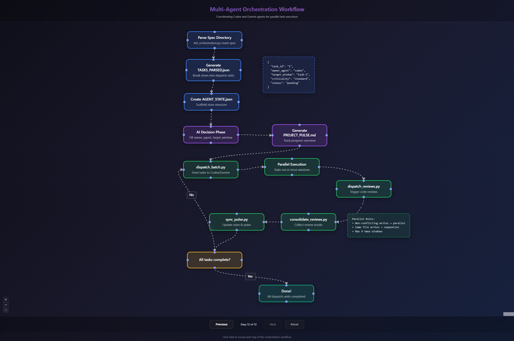

中文 | [English](README.md)

# DevPilot Agents: 多代理编排框架

> **"亚瑟王的王者之剑已破石而出……你是否愿随王一同奔赴疆场？"**

专为复杂软件工程任务设计的高保真 **多代理编排系统**。借鉴"圆桌会议"哲学，由 **亚瑟王** (编排者) 协调专业代理，大规模地实现、评审并同步代码库变更。

## 核心架构：圆桌会议

| 角色                     | 代理     | 职责                                    |
| :----------------------- | :------- | :-------------------------------------- |
| **亚瑟王 (King Arthur)** | 编排者   | 规划、授权、质量门禁及项目状态同步。    |
| **高文 (Gawain)**        | 决策骑士 | 内环决策、严格的 JSON 输出及逻辑验证。  |
| **Codex/Gemini**         | 执行者   | 分布式执行代码 (Codex) 与 UI (Gemini)。 |
| **codeagent-wrapper**    | 执行层   | 驱动后端并行运行的 Go 运行时。          |

## 前置要求

- **Go 1.21+**：编译 `codeagent-wrapper` 必需
- **Claude Code / OpenCode**：触发技能所需的环境

## 安装步骤

### 步骤 1：安装技能

```bash
npx skills add PeterFile/devpilot-agents
```

此命令将本仓库的所有技能安装到你的代理环境中。

### 步骤 2：编译 codeagent-wrapper

```bash
git clone https://github.com/PeterFile/devpilot-agents.git
cd devpilot-agents/codeagent-wrapper
go build -o codeagent-wrapper .
```

Windows：

```powershell
go build -o codeagent-wrapper.exe .
```

### 步骤 3：添加到 PATH

**Linux/macOS：**

```bash
export PATH="$PWD:$PATH"
```

**Windows (PowerShell)：**

```powershell
$env:PATH = "$PWD;$env:PATH"
```

## 使用技能

在 Claude Code / OpenCode 中描述任务即可自动触发技能：

| 触发示例                                                    | 技能                     |
| ----------------------------------------------------------- | ------------------------ |
| "Start orchestration from spec at `.kiro/specs/my-feature`" | multi-agent-orchestrator |
| "Run orchestration for `payment-integration`"               | multi-agent-orchestrator |
| "Create requirements for a new feature"                     | kiro-specs               |
| "Help me write tests first"                                 | test-driven-development  |

### 可用技能

| 技能                         | 描述                                      |
| ---------------------------- | ----------------------------------------- |
| **multi-agent-orchestrator** | 从 Kiro 规范编排多代理工作流              |
| **kiro-specs**               | 规范驱动工作流：需求 → 设计 → 任务 → 执行 |
| **test-driven-development**  | 红-绿-重构 TDD 工作流                     |

## 项目结构

```
├── skills/
│   ├── multi-agent-orchestration/   # 核心编排技能
│   ├── kiro-specs/                  # 规格驱动工作流技能
│   └── test-driven-development/     # TDD 技能
├── .opencode/agents/                # 代理定义
├── codeagent-wrapper/               # Go 执行引擎
└── docs/                            # 文档
```

## 流程图

[](https://peterfile.github.io/devpilot-agents/)

**[查看交互式流程图](https://peterfile.github.io/devpilot-agents/)** - 点击逐步查看动画演示。

`flowchart/` 目录包含源代码。本地运行：

```bash
cd flowchart
npm install
npm run dev
```

## 文档

- **[架构说明 (docs/ARCHITECTURE_CN.md)](docs/ARCHITECTURE_CN.md)**：圆桌会议代理协作机制。
- **[快速开始 (docs/QUICK-START_CN.md)](docs/QUICK-START_CN.md)**：入门指南。

## 致谢

本项目基于以下优秀开源项目构建：

| 组件                  | 来源                                                |
| --------------------- | --------------------------------------------------- |
| **codeagent-wrapper** | [cexll/myclaude](https://github.com/cexll/myclaude) |
| **编排循环思路**      | [ralph](https://github.com/snarktank/ralph)                                     |
| **Skills 规范**       | [claude_skills](https://github.com/anthropics/skills)                     |

---

**Claude Code + 分布式编排 = 自主工程的未来。**
