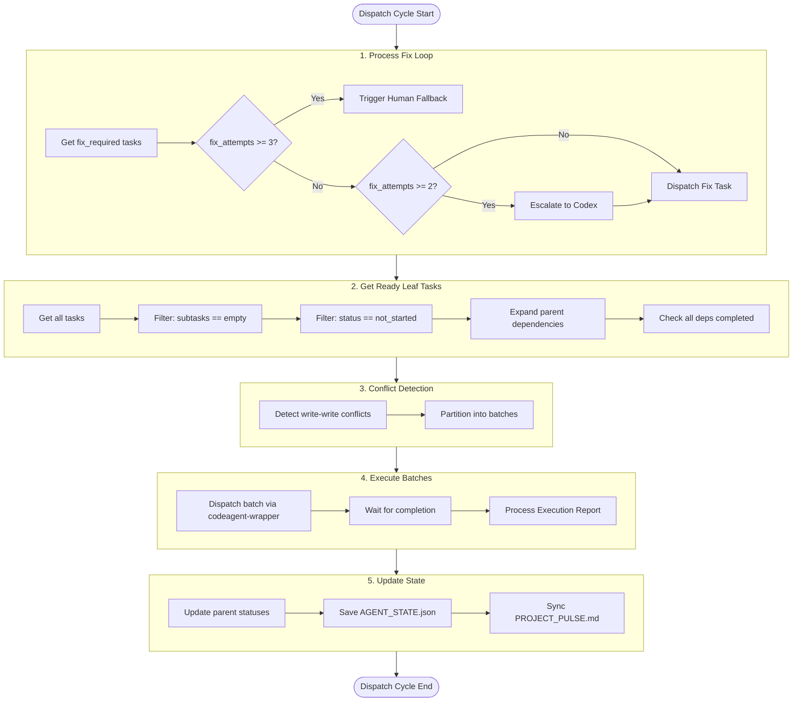

# Multi-Agent Orchestration Workflow Simulation

This document simulates the complete workflow of the multi-agent orchestration system, with special focus on task hierarchy, execution states, file conflict detection, and fix loop workflow.

## Task Hierarchy Explained

### Parent-Subtask Relationship

In the task system, tasks follow a hierarchical numbering scheme:

```
Task 2          (Parent task - container only, NOT dispatched)
├── Task 2.1    (Leaf subtask - dispatched for execution)
└── Task 2.2    (Leaf subtask - dispatched for execution)
```

**Key Points:**
- **Task 2** is a parent task (container) - **NEVER dispatched directly**
- **Task 2.1** and **Task 2.2** are leaf subtasks (child tasks) - **dispatched for execution**
- Subtasks are identified by the decimal notation (e.g., `2.1` means subtask 1 of task 2)
- The `parent_id` field links subtasks to their parent
- **Only leaf tasks (tasks with no subtasks) are dispatched**

### Parent Task Container Model

**Critical Behavior:**
- Parent tasks act as **containers** for organizational purposes
- Parent tasks are **NEVER dispatched** for execution
- Parent task status is **derived** from subtask statuses:

| Subtask States | Parent Status |
|----------------|---------------|
| All completed | completed |
| Any blocked | blocked |
| Any fix_required | fix_required |
| Any in_progress/pending_review/under_review/final_review | in_progress |
| Otherwise | not_started |

### Dependency Expansion

When a task depends on a parent task, the dependency is **expanded** to all leaf subtasks:

```
Task 3 depends on Task 2
    ↓ (expansion)
Task 3 depends on [Task 2.1, Task 2.2]
```

This ensures Task 3 waits for **ALL** subtasks of Task 2 to complete.


## Execution State Machine

### Task Status Flow (Extended with Fix Loop)

```
                                    ┌──────────────────┐
                                    │   not_started    │
                                    └────────┬─────────┘
                                             │ dispatch
                                             ▼
                                    ┌──────────────────┐
                              ┌────►│   in_progress    │◄────┐
                              │     └────────┬─────────┘     │
                              │              │ complete      │
                              │              ▼               │
                              │     ┌──────────────────┐     │
                              │     │  pending_review  │     │
                              │     └────────┬─────────┘     │
                              │              │ review start  │
                              │              ▼               │
                              │     ┌──────────────────┐     │
                              │     │   under_review   │     │
                              │     └────────┬─────────┘     │
                              │              │               │
                              │    ┌─────────┴─────────┐     │
                              │    ▼                   ▼     │
                              │ [none/minor]    [major/critical]
                              │    │                   │     │
                              │    ▼                   ▼     │
                              │ ┌────────┐    ┌─────────────┐│
                              │ │ final  │    │ fix_required││
                              │ │ review │    └──────┬──────┘│
                              │ └───┬────┘           │       │
                              │     │          ┌─────┴─────┐ │
                              │     │          ▼           ▼ │
                              │     │    [attempts<3] [attempts≥3]
                              │     │          │           │
                              │     │          │           ▼
                              │     │          │    ┌─────────────┐
                              │     │          │    │   blocked   │
                              │     │          │    │  (human)    │
                              │     │          │    └─────────────┘
                              │     │          │
                              │     │          └───────────────┘
                              │     │                 (retry)
                              │     ▼
                              │ ┌──────────────────┐
                              │ │    completed     │
                              │ └──────────────────┘
                              │
                              └─── (fix dispatch)
```

### Valid State Transitions

```python
VALID_TRANSITIONS = {
    "not_started": ["in_progress", "blocked"],
    "in_progress": ["pending_review", "blocked"],
    "pending_review": ["under_review", "blocked"],
    "under_review": ["final_review", "fix_required", "blocked"],
    "fix_required": ["in_progress", "blocked"],
    "final_review": ["completed", "blocked"],
    "completed": [],
    "blocked": ["not_started", "in_progress", "fix_required"],
}
```

### Blocked State

```
Any State ──► blocked (when dependency fails, fix loop exhausted, or human decision needed)
blocked ──► not_started (when unblocked by fix success)
blocked ──► fix_required (when blocker resolved and fix still needed)
```


## File Conflict Detection

### File Manifest Declaration

Tasks can declare which files they read and write using markers in task details:

```markdown
- [ ] 2. Implement JWT authentication
  - Implement token generation and validation
  - _Requirements: 2.1, 2.2_
  - _writes: src/auth/jwt.ts, src/auth/index.ts_
  - _reads: src/config/auth.ts_
```

### Conflict Detection Rules

| Scenario | Behavior |
|----------|----------|
| Write-Write conflict | Tasks placed in separate batches (serialized) |
| No file manifest | Task runs serially for safety |
| Read-only tasks | Can batch with non-conflicting write tasks |
| Non-conflicting writes | Can batch together (parallel) |

### Batch Execution Model

```
Ready Tasks: [A, B, C, D, E]
    │
    ▼ (conflict detection)
Batch 1: [A, C] ─── parallel execution ───► complete
    │
    ▼
Batch 2: [B, D] ─── parallel execution ───► complete
    │
    ▼
Batch 3: [E]    ─── serial (no manifest) ──► complete
```

**Key Points:**
- Batches execute **sequentially** (Batch N completes before Batch N+1 starts)
- Tasks **within** a batch may run in parallel
- This ensures file conflict safety between batches


## Fix Loop Workflow

### Overview

When a review finds **critical** or **major** issues, the task enters a fix loop:

```
Review Fails (critical/major)
    │
    ▼
┌─────────────────────────────────────────────────────────────┐
│                      FIX LOOP                               │
│                                                             │
│  ┌─────────┐    ┌─────────┐    ┌─────────┐    ┌─────────┐  │
│  │Attempt 1│───►│Attempt 2│───►│Attempt 3│───►│ Human   │  │
│  │(kiro-cli)│   │(kiro-cli)│   │ (codex) │   │Fallback │  │
│  └────┬────┘    └────┬────┘    └────┬────┘    └─────────┘  │
│       │              │              │                       │
│       ▼              ▼              ▼                       │
│    Review         Review         Review                     │
│       │              │              │                       │
│   pass/fail      pass/fail      pass/fail                   │
│                                                             │
└─────────────────────────────────────────────────────────────┘
    │
    ▼ (on pass)
Continue to final_review → completed
```

### Fix Attempts Timeline

```
fix_attempts = number of COMPLETED fix attempts

Initial review fails     → fix_attempts = 0, enter fix loop
1st fix dispatched       → fix_attempts = 0 (display: "Attempt 1/3")
1st fix completes        → fix_attempts = 1
1st fix review fails     → fix_attempts = 1, continue fix loop
2nd fix dispatched       → fix_attempts = 1 (display: "Attempt 2/3")
2nd fix completes        → fix_attempts = 2
2nd fix review fails     → fix_attempts = 2, ESCALATE to Codex
3rd fix dispatched       → fix_attempts = 2 (display: "Attempt 3/3", using Codex)
3rd fix completes        → fix_attempts = 3
3rd fix review fails     → fix_attempts = 3, HUMAN FALLBACK
```

### Escalation Thresholds

| Completed Attempts | Action |
|-------------------|--------|
| 0-1 | Retry with original agent (kiro-cli/gemini) |
| 2 | Escalate to Codex |
| 3 | Human fallback (create pending_decision) |

### Dependent Task Blocking

When a task enters fix loop, **all dependent tasks are blocked**:

```
Task 2.1 enters fix loop
    │
    ▼
Block: Task 2.2 (depends on 2.1)
Block: Task 3 (depends on parent Task 2)
Block: Task 4 (depends on Task 2 and Task 3)
```

When fix loop succeeds, blocked tasks are **unblocked** and become ready.


## Workflow Simulation

### Sample Spec: User Authentication Feature

Let's simulate with this task structure:

```markdown
## Tasks

- [ ] 1. Set up project structure
  - Create directory structure
  - _Requirements: 1.1_
  - _writes: package.json, tsconfig.json_

- [ ] 2. Implement authentication service
  - [ ] 2.1 Create auth module
    - Implement login/logout functions
    - _Requirements: 2.1, 2.2_
    - _writes: src/auth/login.ts, src/auth/logout.ts_
  
  - [ ] 2.2 Add password hashing
    - Use bcrypt for secure hashing
    - _Dependencies: 2.1_
    - _Requirements: 2.3_
    - _writes: src/auth/hash.ts_
    - _reads: src/auth/login.ts_

- [ ] 3. Create login UI
  - Depends on: 2
  - _Requirements: 3.1_
  - _writes: src/components/LoginForm.tsx_

- [ ] 4. Integration testing
  - Depends on: 2, 3
  - _Requirements: 4.1_
  - _writes: tests/integration/auth.test.ts_
```

### Phase 1: Initialization

**Command:**
```bash
python scripts/init_orchestration.py /path/to/spec --session auth-feature
```

**AGENT_STATE.json (Initial):**
```json
{
  "spec_path": "/path/to/spec",
  "session_name": "auth-feature",
  "tasks": [
    {
      "task_id": "1",
      "description": "Set up project structure",
      "type": "code",
      "status": "not_started",
      "owner_agent": "kiro-cli",
      "dependencies": [],
      "parent_id": null,
      "subtasks": [],
      "writes": ["package.json", "tsconfig.json"],
      "reads": [],
      "fix_attempts": 0
    },
    {
      "task_id": "2",
      "description": "Implement authentication service",
      "type": "code",
      "status": "not_started",
      "owner_agent": "kiro-cli",
      "dependencies": [],
      "parent_id": null,
      "subtasks": ["2.1", "2.2"],
      "writes": [],
      "reads": [],
      "fix_attempts": 0
    },
    {
      "task_id": "2.1",
      "description": "Create auth module",
      "type": "code",
      "status": "not_started",
      "owner_agent": "kiro-cli",
      "dependencies": [],
      "parent_id": "2",
      "subtasks": [],
      "writes": ["src/auth/login.ts", "src/auth/logout.ts"],
      "reads": [],
      "fix_attempts": 0
    },
    {
      "task_id": "2.2",
      "description": "Add password hashing",
      "type": "code",
      "status": "not_started",
      "owner_agent": "kiro-cli",
      "dependencies": ["2.1"],
      "parent_id": "2",
      "subtasks": [],
      "writes": ["src/auth/hash.ts"],
      "reads": ["src/auth/login.ts"],
      "fix_attempts": 0
    },
    {
      "task_id": "3",
      "description": "Create login UI",
      "type": "ui",
      "status": "not_started",
      "owner_agent": "gemini",
      "dependencies": ["2"],
      "parent_id": null,
      "subtasks": [],
      "writes": ["src/components/LoginForm.tsx"],
      "reads": [],
      "fix_attempts": 0
    },
    {
      "task_id": "4",
      "description": "Integration testing",
      "type": "code",
      "status": "not_started",
      "owner_agent": "kiro-cli",
      "dependencies": ["2", "3"],
      "parent_id": null,
      "subtasks": [],
      "writes": ["tests/integration/auth.test.ts"],
      "reads": [],
      "fix_attempts": 0
    }
  ],
  "review_findings": [],
  "final_reports": [],
  "blocked_items": [],
  "pending_decisions": [],
  "deferred_fixes": [],
  "window_mapping": {}
}
```


### Phase 2: First Batch Dispatch

**Ready Tasks Analysis (Leaf Tasks Only):**
```
Task 1:   ✅ Ready (leaf, no dependencies)
Task 2:   ❌ SKIP - Parent task (has subtasks), NEVER dispatched
Task 2.1: ✅ Ready (leaf, no dependencies)
Task 2.2: ❌ Not ready (depends on 2.1)
Task 3:   ❌ Not ready (depends on 2 → expanded to [2.1, 2.2])
Task 4:   ❌ Not ready (depends on 2, 3)
```

**File Conflict Check:**
```
Task 1 writes: [package.json, tsconfig.json]
Task 2.1 writes: [src/auth/login.ts, src/auth/logout.ts]
→ No conflicts, can batch together
```

**Dispatch Command:**
```bash
codeagent-wrapper --parallel \
  --tmux-session auth-feature \
  --state-file /path/to/AGENT_STATE.json \
  <<'EOF'
---TASK---
id: 1
backend: kiro-cli
workdir: .
---CONTENT---
Task: Set up project structure
...

---TASK---
id: 2.1
backend: kiro-cli
workdir: .
---CONTENT---
Task: Create auth module
...
EOF
```

**Tmux Session Layout (Batch 1):**
```
┌─────────────────────────────────────────────────────────────┐
│ tmux session: auth-feature                                  │
├─────────────────────────────────────────────────────────────┤
│ Window 0: main                                              │
│ ┌─────────────────────────────────────────────────────────┐ │
│ │ Status: Watching AGENT_STATE.json                       │ │
│ │ Tasks in progress: 1, 2.1                               │ │
│ │ Parent Task 2: in_progress (derived from 2.1)           │ │
│ └─────────────────────────────────────────────────────────┘ │
├─────────────────────────────────────────────────────────────┤
│ Window 1: task-1 (Independent)                              │
│ ┌─────────────────────────────────────────────────────────┐ │
│ │ kiro-cli: Set up project structure                      │ │
│ └─────────────────────────────────────────────────────────┘ │
├─────────────────────────────────────────────────────────────┤
│ Window 2: task-2.1 (Independent - leaf subtask)             │
│ ┌─────────────────────────────────────────────────────────┐ │
│ │ kiro-cli: Create auth module                            │ │
│ └─────────────────────────────────────────────────────────┘ │
└─────────────────────────────────────────────────────────────┘
```

**Note:** Task 2 (parent) is NOT dispatched. Only leaf tasks 1 and 2.1 are dispatched.

**State After Batch 1 Completes + Parent Status Update:**
```json
{
  "tasks": [
    {"task_id": "1", "status": "pending_review", ...},
    {"task_id": "2", "status": "in_progress", ...},   // Derived: 2.1 pending_review, 2.2 not_started
    {"task_id": "2.1", "status": "pending_review", ...},
    {"task_id": "2.2", "status": "not_started", ...},
    {"task_id": "3", "status": "not_started", ...},
    {"task_id": "4", "status": "not_started", ...}
  ]
}
```


### Phase 3: Second Batch Dispatch (After 2.1 Review Passes)

**Ready Tasks Analysis (after 2.1 completes):**
```
Task 1:   ✅ completed
Task 2:   ❌ SKIP - Parent task
Task 2.1: ✅ completed
Task 2.2: ✅ Ready (2.1 completed)
Task 3:   ❌ Not ready (2.2 not completed yet)
Task 4:   ❌ Not ready (2, 3 not completed)
```

**Dispatch Command:**
```bash
codeagent-wrapper --parallel \
  --tmux-session auth-feature \
  --state-file /path/to/AGENT_STATE.json \
  <<'EOF'
---TASK---
id: 2.2
backend: kiro-cli
workdir: .
dependencies: 2.1
---CONTENT---
Task: Add password hashing
...
EOF
```

**Tmux Session Layout (Task 2.2 as Dependent):**
```
┌─────────────────────────────────────────────────────────────┐
│ Window 2: task-2.1                                          │
│ ┌───────────────────────────┬───────────────────────────┐   │
│ │ Pane 0: kiro-cli          │ Pane 1: kiro-cli          │   │
│ │ task-2.1 (completed)      │ task-2.2 (in_progress)    │   │
│ │ ✅ Create auth module     │ 🔄 Add password hashing   │   │
│ └───────────────────────────┴───────────────────────────┘   │
└─────────────────────────────────────────────────────────────┘
```

**Key Insight:** Task 2.2 runs in a **pane** within Task 2.1's window because it has a dependency on 2.1.


### Phase 4: Fix Loop Simulation (Task 2.2 Review Fails)

**Scenario:** Review of Task 2.2 finds critical issues.

**Review Finding:**
```json
{
  "task_id": "2.2",
  "severity": "critical",
  "findings": [
    {
      "severity": "critical",
      "summary": "Password hashing uses weak algorithm",
      "details": "Using MD5 instead of bcrypt. Must use bcrypt with salt rounds >= 10."
    },
    {
      "severity": "major",
      "summary": "Missing input validation",
      "details": "Password length not validated before hashing."
    }
  ]
}
```

**Fix Loop Entry:**
```
1. Task 2.2 status → fix_required
2. Block dependent tasks:
   - Task 3 (depends on parent Task 2) → blocked
   - Task 4 (depends on Task 2, 3) → blocked
3. Add to blocked_items
4. Update parent Task 2 status → fix_required (derived)
```

**State After Fix Loop Entry:**
```json
{
  "tasks": [
    {"task_id": "1", "status": "completed"},
    {"task_id": "2", "status": "fix_required"},  // Derived from 2.2
    {"task_id": "2.1", "status": "completed"},
    {
      "task_id": "2.2",
      "status": "fix_required",
      "fix_attempts": 0,
      "last_review_severity": "critical",
      "review_history": [
        {
          "attempt": 0,
          "severity": "critical",
          "findings": [...],
          "reviewed_at": "2026-01-09T10:30:00Z"
        }
      ]
    },
    {"task_id": "3", "status": "blocked", "blocked_by": "2.2"},
    {"task_id": "4", "status": "blocked", "blocked_by": "2.2"}
  ],
  "blocked_items": [
    {
      "task_id": "2.2",
      "blocking_reason": "Upstream task 2.2 requires fixes (critical)",
      "dependent_tasks": ["3", "4"]
    }
  ]
}
```

**Fix Attempt 1 Dispatch:**
```
## FIX REQUEST - Attempt 1/3

### Original Task
Add password hashing

### Review Findings (MUST FIX)
- [CRITICAL] Password hashing uses weak algorithm
  Details: Using MD5 instead of bcrypt. Must use bcrypt with salt rounds >= 10.
- [MAJOR] Missing input validation
  Details: Password length not validated before hashing.

### Instructions
1. Review the findings above carefully
2. Fix ALL critical and major issues
3. Ensure the fix doesn't break existing functionality
4. Run tests to verify the fix
```

**After Fix Attempt 1 Completes:**
```
fix_attempts: 0 → 1
status: in_progress → pending_review
→ Re-dispatch review
```


### Phase 5: Fix Loop Success

**Scenario:** Fix Attempt 1 review passes (severity: none/minor).

**Actions:**
```
1. Task 2.2 status → final_review → completed
2. Unblock dependent tasks:
   - Task 3 → not_started (ready to dispatch)
   - Task 4 → not_started (still waiting for Task 3)
3. Remove from blocked_items
4. Update parent Task 2 status → completed (all subtasks completed)
```

**State After Fix Loop Success:**
```json
{
  "tasks": [
    {"task_id": "1", "status": "completed"},
    {"task_id": "2", "status": "completed"},   // Derived: all subtasks completed
    {"task_id": "2.1", "status": "completed"},
    {"task_id": "2.2", "status": "completed", "fix_attempts": 1},
    {"task_id": "3", "status": "not_started"},  // Unblocked, ready
    {"task_id": "4", "status": "not_started"}   // Still waiting for Task 3
  ],
  "blocked_items": []
}
```

### Phase 6: Human Fallback Simulation

**Scenario:** Task 2.2 fails all 3 fix attempts.

**Timeline:**
```
Attempt 1 (kiro-cli) → review fails → fix_attempts = 1
Attempt 2 (kiro-cli) → review fails → fix_attempts = 2, ESCALATE
Attempt 3 (codex)    → review fails → fix_attempts = 3, HUMAN FALLBACK
```

**Human Fallback State:**
```json
{
  "tasks": [
    {
      "task_id": "2.2",
      "status": "blocked",
      "blocked_reason": "human_intervention_required",
      "fix_attempts": 3,
      "escalated": true,
      "escalated_at": "2026-01-09T11:00:00Z",
      "original_agent": "kiro-cli"
    }
  ],
  "pending_decisions": [
    {
      "id": "human-fallback-2.2",
      "task_id": "2.2",
      "priority": "critical",
      "context": "HUMAN INTERVENTION REQUIRED\n\nTask: 2.2 - Add password hashing\nFix Attempts: 3/3\n\nReview History:\n...",
      "options": [
        "I've fixed it manually - resume",
        "Skip this task - continue without it",
        "Abort orchestration"
      ]
    }
  ]
}
```


## Task Dispatch Flow Summary

### Complete Dispatch Cycle



### Key Invariants

1. **Parent tasks are NEVER dispatched** - Only leaf tasks (no subtasks) are dispatched
2. **Parent status is ALWAYS derived** - Aggregated from subtask statuses after every dispatch
3. **Dependencies are ALWAYS expanded** - Parent task deps become all leaf subtask deps
4. **Fix loop runs FIRST** - Before getting ready tasks
5. **Batches run SEQUENTIALLY** - Ensures file conflict safety
6. **State is ALWAYS persisted** - After every dispatch cycle


## Task 2, 2.1, 2.2 Relationship Summary

### Organizational Hierarchy

```
Task 2: "Implement authentication service" (Parent - CONTAINER ONLY)
    │
    ├── Task 2.1: "Create auth module" (Leaf - DISPATCHED)
    │       └── No dependencies → Runs immediately
    │
    └── Task 2.2: "Add password hashing" (Leaf - DISPATCHED)
            └── Depends on 2.1 → Waits for 2.1 to complete
```

### Execution Timeline (Normal Flow)

```
Time ──────────────────────────────────────────────────────────►

Batch 1 (leaf tasks with no deps):
┌─────────────────────────────────────────────────────────────┐
│ Task 1   ████████████████████ (parallel)                    │
│ Task 2.1 ████████████████████ (parallel)                    │
│ Task 2   [NOT DISPATCHED - parent container]                │
└─────────────────────────────────────────────────────────────┘

Batch 2 (after 2.1 completes):
                              ┌────────────────────────────────┐
                              │ Task 2.2 ████████████████████  │
                              └────────────────────────────────┘

Batch 3 (after 2.2 completes → Task 2 completed):
                                            ┌──────────────────┐
                                            │ Task 3 ██████████│
                                            └──────────────────┘

Batch 4 (after Task 3 completes):
                                                        ┌──────┐
                                                        │Task 4│
                                                        └──────┘
```

### Key Behaviors

| Aspect | Task 2 | Task 2.1 | Task 2.2 |
|--------|--------|----------|----------|
| **Type** | Parent (container) | Leaf (subtask) | Leaf (subtask) |
| **Dispatched?** | ❌ NEVER | ✅ Yes | ✅ Yes |
| **parent_id** | null | "2" | "2" |
| **subtasks** | ["2.1", "2.2"] | [] | [] |
| **Dependencies** | [] | [] | ["2.1"] |
| **Status Source** | Derived from subtasks | Own execution | Own execution |
| **Runs When** | N/A | Immediately | After 2.1 completes |
| **Window** | N/A | Own window | Pane in 2.1's window |

### Dependency Expansion Example

```
Task 3 declares: dependencies: ["2"]
    │
    ▼ (expansion)
Task 3 effective deps: ["2.1", "2.2"]
    │
    ▼ (ready check)
Task 3 ready when: 2.1 completed AND 2.2 completed
```


## Extended Task Data Model

### Task Schema (with Fix Loop and File Manifest)

```json
{
  "task_id": "string",
  "description": "string",
  "type": "code | ui | review",
  "status": "not_started | in_progress | pending_review | under_review | fix_required | final_review | completed | blocked",
  "owner_agent": "kiro-cli | gemini | codex",
  "dependencies": ["task_id"],
  "subtasks": ["task_id"],
  "parent_id": "string | null",
  
  "writes": ["file_path"],
  "reads": ["file_path"],
  
  "fix_attempts": 0,
  "max_fix_attempts": 3,
  "escalated": false,
  "escalated_at": "ISO timestamp | null",
  "original_agent": "string | null",
  "last_review_severity": "critical | major | minor | none | null",
  "review_history": [
    {
      "attempt": 0,
      "severity": "critical",
      "findings": [
        {
          "severity": "critical",
          "summary": "Issue summary",
          "details": "Detailed explanation"
        }
      ],
      "reviewed_at": "ISO timestamp"
    }
  ],
  "blocked_reason": "string | null",
  "blocked_by": "task_id | null"
}
```

## PROJECT_PULSE.md Updates

After each batch, sync_pulse.py updates the human-readable status:

```markdown
# PROJECT_PULSE.md

## Mental Model
Authentication system with modular design:
- Auth module handles login/logout
- Password hashing via bcrypt
- UI components for login form

## Narrative Delta
### Recent Completions
- ✅ Task 1: Project structure created
- ✅ Task 2.1: Auth module created
- 🔧 Task 2.2: Password hashing (fix loop - attempt 1/3)

### Upcoming
- Task 3: Login UI (blocked by Task 2.2 fix)
- Task 4: Integration testing (blocked by Tasks 2, 3)

## Risks & Debt
### Blocked Items
- Task 2.2 requires fixes (critical severity)
  - Dependent tasks blocked: 3, 4

### Pending Decisions
- None
```


## Conclusion

The multi-agent orchestration system provides:

1. **Hierarchical task organization** via parent-subtask relationships
   - Parent tasks are containers, NEVER dispatched
   - Only leaf tasks are executed
   - Parent status derived from subtask statuses

2. **Explicit dependency management** for execution ordering
   - Dependencies on parent tasks expand to all leaf subtasks
   - Tasks wait for ALL expanded dependencies to complete

3. **File conflict detection** for parallel safety
   - Write-write conflicts detected and serialized
   - Tasks without manifests run serially for safety
   - Conflict-free tasks batch together for parallelism

4. **Fix loop workflow** for failed reviews
   - Up to 3 retry attempts with feedback injection
   - Escalation to Codex after 2 failures
   - Human fallback after 3 failures
   - Dependent tasks blocked during fix loop

5. **Visual task grouping** in tmux windows/panes
   - Independent tasks get own windows
   - Dependent tasks create panes in dependency's window

6. **Synchronous batch dispatch** for predictable orchestration
   - Batches execute sequentially
   - Tasks within batch may run in parallel

7. **Dual-document state** (JSON for machines, Markdown for humans)
   - AGENT_STATE.json for machine coordination
   - PROJECT_PULSE.md for human visibility
