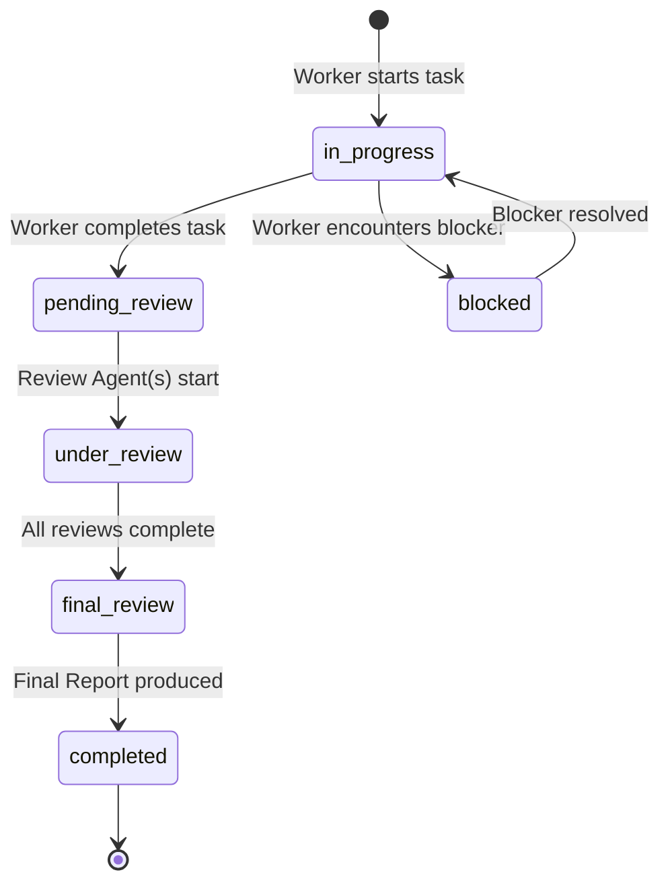

# Agent Pulse Coordination

## Overview

Agent Pulse Coordination enables structured multi-agent collaboration through a dual-document architecture:
- **Human Layer**: `PROJECT_PULSE.md` - A 30-second readable project dashboard
- **Agent Layer**: `AGENT_STATE.json` - Machine-readable coordination state

**Core Principle**: Agents fix problems quickly without human-style review-revise cycles. If an issue can be fixed immediately, fix it and mark it. Only defer when necessary.

## PULSE Document Structure (Human Layer)

The `PROJECT_PULSE.md` file is designed for humans to understand project status in 30 seconds.

**Required Sections:**

### 🟢 Mental Model
- One-sentence project description
- Mermaid diagram showing core architecture

### 🟡 Narrative Delta
- Business intent of recent changes (NOT implementation details)
- Focus on what changed and why, not how

### 🔴 Risks & Debt
- **Cognitive Load Warnings**: Areas of high complexity
- **Technical Debt**: Known issues needing future attention
- **Pending Decisions**: Items requiring human input

### 🔗 Semantic Anchors
- Navigation links in format: `[Module] path/to/file.ext -> SymbolName`
- Enables quick code navigation to key components

## Agent Roles

### Worker Agent
Executes specific tasks (e.g., coding), produces code and Task_Updates.

**Protocol:**
- Submit Task_Update to Agent_State after completing work
- Assign criticality level: `standard`, `complex`, or `security-sensitive`
- Set review_phase to `pending_review` after task completion
- Add entries to `blocked_items` when encountering blockers
- ✅ CAN: Read/write `tasks`, add to `blocked_items`
- ❌ CANNOT: Modify `PULSE_Document`, `review_findings`, or `final_reports`

**Task_Update Format:**
```json
{
  "task_id": "task-001",
  "status": "pending_review",
  "summary": "Implemented user authentication module",
  "anchors": ["src/auth/login.py -> authenticate_user"],
  "self_assessment": "Code passed unit tests",
  "criticality": "standard"
}
```

### Review Agent
Audits Worker's work independently, produces Review_Finding.

**Protocol:**
- Audit code changes when task has `review_phase: pending_review`
- Produce Review_Finding with severity assessment: `critical`, `major`, `minor`, or `none`
- For `standard` tasks: single reviewer sufficient
- For `complex` or `security-sensitive` tasks: multiple reviewers work in parallel
- ✅ CAN: Read tasks, write to `review_findings`
- ❌ CANNOT: Fix issues directly, modify code, `PULSE_Document`, or `final_reports`

**Review_Finding Format:**
```json
{
  "finding_id": "finding-001",
  "task_id": "task-001",
  "reviewer_agent": "review-agent-1",
  "issues_found": [
    {"issue_id": "issue-001", "description": "Missing input validation", "severity": "major"}
  ],
  "severity": "major"
}
```

### Final Review Agent
Consolidates findings from all reviewers and decides on fixes.

**Protocol:**
- Wait until all required Review_Agents have submitted findings
- Consolidate findings into a Final_Report
- Make fix decisions for each issue:
  - `fixed_immediately`: Fix the issue now and mark it done
  - `deferred`: Add to `deferred_fixes` with reason
  - `superseded`: Issue covered by a later fix
- ✅ CAN: Read all state, write to `final_reports`, add to `deferred_fixes`
- ❌ CANNOT: Modify `PULSE_Document`

**Final_Report Format:**
```json
{
  "report_id": "report-001",
  "task_id": "task-001",
  "findings_summary": "Found 1 major issue, fixed immediately",
  "fix_decisions": [
    {"issue_id": "issue-001", "status": "fixed_immediately", "details": "Added input validation"}
  ],
  "conclusion": "Task complete, code quality good"
}
```

### Guardian Agent
Coordinator that aggregates state and generates PULSE reports for humans.

**Protocol:**
- **ONLY** entity permitted to write to `PULSE_Document`
- Aggregate Final_Reports from Agent_State into PULSE updates
- Synthesize `fix_decisions` into human-readable Narrative Delta
- Regenerate Mermaid diagram when architectural changes detected
- Surface `deferred_fixes` and `pending_decisions` prominently in Risks & Debt
- Escalate visibility for decisions pending >24 hours
- ✅ CAN: Read all Agent_State, write to `PULSE_Document`
- ❌ CANNOT: Modify task execution or review findings

## Task Flow State Machine



**Valid State Transitions:**

| From | To | Trigger |
|------|-----|---------|
| `in_progress` | `pending_review` | Worker completes task |
| `in_progress` | `blocked` | Worker encounters blocker |
| `pending_review` | `under_review` | Review Agent starts auditing |
| `under_review` | `final_review` | All required reviews submitted |
| `final_review` | `completed` | Final Report produced with conclusion |
| `blocked` | `in_progress` | Blocker resolved |

**Invalid Transitions** (will be rejected by validator):
- Skipping phases (e.g., `pending_review` → `completed`)
- Going backwards (e.g., `completed` → `under_review`)

## Criticality Levels

| Level | Review Requirement |
|-------|-------------------|
| `standard` | Exactly 1 Review Agent |
| `complex` | ≥2 Review Agents in parallel |
| `security-sensitive` | ≥2 Review Agents with security focus |

## Human Decision Requests

When any agent needs human input, follow this process:

### Step 1: Request Decision
Add entry to `pending_decisions` in Agent_State:
```json
{
  "decision_id": "decision-001",
  "context": "Authentication strategy for API endpoints",
  "options": [
    {
      "option_id": "opt-1",
      "description": "JWT tokens with refresh",
      "trade_offs": "More complex but industry standard"
    },
    {
      "option_id": "opt-2", 
      "description": "Session-based auth",
      "trade_offs": "Simpler but requires server state"
    }
  ],
  "requesting_agent": "worker-agent-1",
  "created_at": "2025-01-04T10:30:00Z"
}
```

### Step 2: Surface to Human
Guardian Agent surfaces pending decisions in PULSE Risks & Debt section.

### Step 3: Human Decides
Human reviews options and makes decision.

### Step 4: Record Resolution
Guardian records the resolution and removes from `pending_decisions`.

### Escalation
If decisions remain pending beyond 24 hours, Guardian Agent SHALL escalate visibility in PULSE_Document (e.g., move to top of Risks & Debt, add warning emoji).

## Resources

**Always run scripts with `--help` first** to see usage before reading source code.

### scripts/
- `validate_agent_state.py` - Validates AGENT_STATE.json against schema
  ```bash
  python scripts/validate_agent_state.py path/to/AGENT_STATE.json
  ```
- `pulse_parser.py` - Parses and generates PULSE documents
  ```bash
  python scripts/pulse_parser.py parse path/to/PROJECT_PULSE.md
  python scripts/pulse_parser.py generate --output path/to/PROJECT_PULSE.md
  ```
- `sync_pulse.py` - Synchronizes Agent State to PULSE document
  ```bash
  python scripts/sync_pulse.py path/to/AGENT_STATE.json path/to/PROJECT_PULSE.md
  ```

### references/
- `agent-state-schema.json` - JSON Schema for AGENT_STATE.json validation
- `pulse-template.md` - Template for creating new PROJECT_PULSE.md files
