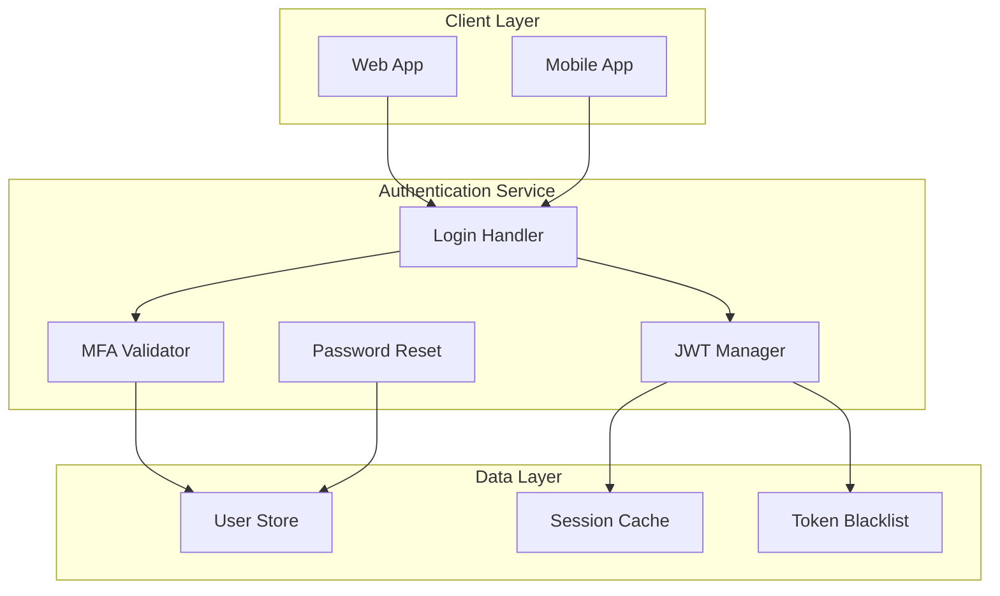

# PROJECT_PULSE

## 🟢 Mental Model

A secure user authentication system providing JWT-based login, password reset, and multi-factor authentication for web applications.

## 🟡 Narrative Delta

- **2025-01-04**: Completed core authentication flow with JWT support. Users can now securely log in and receive tokens for API access. Rate limiting added to prevent brute-force attacks.
- **2025-01-03**: Password reset functionality under review. Implements secure token-based reset flow with email verification.
- **2025-01-02**: Project initialized with basic user model and database schema.

## 🔴 Risks & Debt

### Cognitive Load Warnings
- **JWT Token Flow**: The token refresh mechanism involves multiple validation steps across `jwt_manager.py` and `middleware.py`. Consider adding sequence diagram documentation.
- **MFA Integration**: Multi-factor authentication touches 4 different modules; changes require careful coordination.

### Technical Debt
- **Single Provider Limitation**: Current implementation only supports one OAuth provider. Multi-provider support deferred to v2 (see `defer-001`).
- **Session Storage**: Using in-memory session cache; needs migration to Redis for production scalability.

### Pending Decisions
- **[decision-001] Admin Panel Auth Strategy**: Need human decision on session-based vs stateless JWT for admin panel.
  - Option 1: Session-based (simpler, requires storage)
  - Option 2: Stateless JWT (no storage, harder revocation)
  - Requested by: coding-agent-1

### Blocked Items
- **[block-001]**: OAuth integration blocked waiting for third-party API credentials from DevOps team (since 2025-01-03).

## 🔗 Semantic Anchors

- [Auth] `src/auth/login.py` -> `authenticate_user`
- [Auth] `src/auth/jwt_manager.py` -> `create_access_token`
- [Auth] `src/auth/jwt_manager.py` -> `verify_token`
- [Auth] `src/auth/mfa.py` -> `validate_totp`
- [Reset] `src/auth/password_reset.py` -> `initiate_reset`
- [Reset] `src/auth/password_reset.py` -> `complete_reset`
- [Middleware] `src/middleware/rate_limit.py` -> `RateLimitMiddleware`
- [Models] `src/models/user.py` -> `User`
- [Models] `src/models/session.py` -> `Session`
