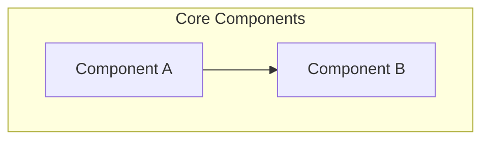

# PROJECT_PULSE

## 🟢 Mental Model

<!-- One-sentence project description -->
[Project description: A single sentence describing the project's purpose and core functionality]

## 🟡 Narrative Delta

<!-- Business intent of recent changes, not implementation details -->
- [Date]: [Business intent of recent changes]

## 🔴 Risks & Debt

### Cognitive Load Warnings
- [Areas of high complexity that require careful attention]

### Technical Debt
- [Known issues or shortcuts that need future attention]

### Pending Decisions
- [Decisions requiring human input]

## 🔗 Semantic Anchors

<!-- Format: [Module] `path/to/file.ext` -> `SymbolName` -->
- [Core] `src/main.py` -> `main_function`
- [Utils] `src/utils.py` -> `helper_function`
